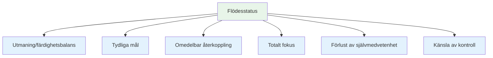
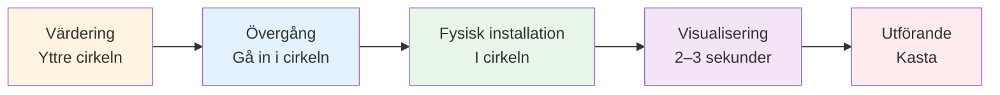
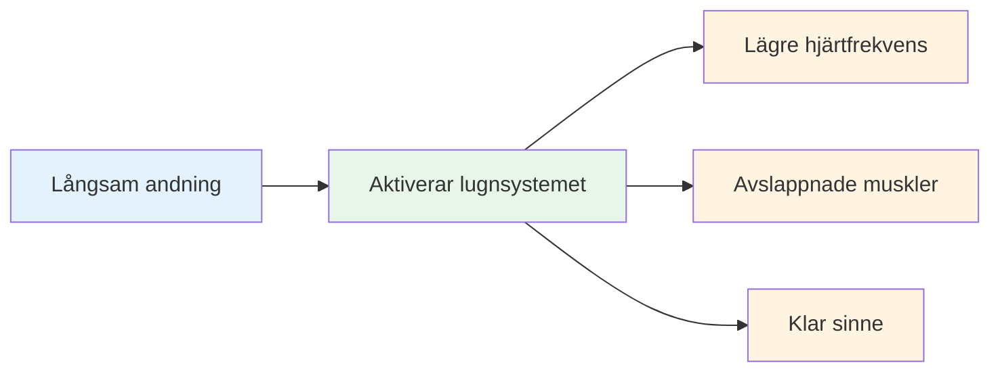
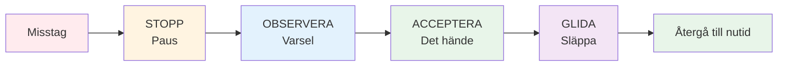

# Att komma in i zonen: Praktiska tekniker
<AdBanner />

Zonen är inte något som bara händer. Med övning kan du lära dig att använda den mer regelbundet. Här är beprövade tekniker som används av elitidrottare.

::: tip Den stora idén
**Du kan träna dig själv att komma in i flödestillstånd mer tillförlitligt.** Zonen är inte magisk – det är en färdighet du utvecklar genom specifika tekniker och konsekvent övning.
:::

## De sex villkoren för flöde

Forskning visar att flödestillstånd kräver vissa villkor:

| Skick | Vad det betyder | I boule |
|-----------|---------------|-------------|
| **Balans mellan utmaningar/färdigheter** | Uppgiften utmanar dig men är uppnåelig | Tävla på din nivå, varken för lätt eller omöjligt |
| **Tydliga mål** | Du vet precis vad du försöker göra | Specifikt mål, tydlig avsikt för varje kast |
| **Omedelbar återkoppling** | Du ser resultat av dina handlingar | Bollen landar, du vet om den fungerade |
| **Totalt fokus** | Full uppmärksamhet på uppgiften | Inga distraktioner, bara nuet |
| **Förlust av självmedvetenhet** | Inte orolig för hur du ser ut | Bryr mig inte om vem som tittar |
| **Känsla av kontroll** | Känner mig kapabel att hantera det | Lita på din träning och förmåga |

::: info Viktig insikt
När dessa sex villkor är i linje blir flöde möjligt. Ditt jobb är att skapa dessa villkor medvetet.
:::

## Teknik 1: Förbehandlingsrutinen

Din rutiner före träningen är din inkörsport till zonen. Det är en konsekvent sekvens som signalerar till din hjärna: &quot;Det är dags att genomföra.&quot;

### Bygga din rutin

En bra rutin har dessa element:

::: details 1. Visuell bedömning (utanför cirkeln)
- Läs terrängen
- Välj ditt mål och landningsplats
- Bestäm kasttypen

**Det är här tänkandet sker.** Ta din tid här.
:::

::: details 2. Övergång (Att gå in i cirkeln)
- Ta ett andetag
- Släpp analysen
- Växla till körningsläge

**Detta är strömbrytaren.** Analysen slutar här.
:::

::: details 3. Fysisk utlösare (i cirkeln)
- En konsekvent hållningsinställning
- En specifik greppkontroll
- En liten rörelse som känns naturlig för dig

**Gör det konsekvent.** Samma varje gång.
:::

::: details 4. Visualisering (Kort, 2–3 sekunder)
- Se bollens bana
- Känn det lyckade kastet
- Anslut till ditt mål

**Håll det kort.** För långt = övertänkande.
:::

::: details 5. Utförande
- Fokusera bara på målet
- Lita på din kropp
- Släpp utan tvekan

**Endast externt fokus.** Mål, inte teknik.
:::

### Varför rutiner fungerar

Din rutin blir en &quot;mindfulnessklocka&quot; – en signal som förändrar ditt hjärntillstånd. Med tillräckligt med repetition utlöser bara det att du börjar din rutin den mentala förändringen till flöde.

::: tip Övningstips
Använd din rutin på VARJE kast under träning – inte bara tävlingar. Rutinen måste bli automatisk.
:::

<AdInArticle />

## Teknik 2: Externt fokus

Var du lägger din uppmärksamhet spelar stor roll.

| Fokustyp | Vad du tycker om | Exempeltankar |
|------------|---------------------|------------------|
| **Internt** ❌ | Din kroppsmekanik | &quot;Håll min armbåge rak&quot;  &quot;Följ upp ordentligt&quot;  &quot;Håll inte för hårt&quot; |
| **Extern** ✅ | Mål och resultat | &quot;Landa den där&quot;  &quot;Se vägen&quot;  &quot;Träffa målet&quot; |

::: tip Forskningsresultat
Studier visar konsekvent att **externt fokus ger bättre resultat** för skickliga spelare. Din kropp vet vad den ska göra – låt den verka.
:::

### Öva externt fokus
- Välj en specifik plats på marken (inte bara &quot;nära domkraften&quot;)
- Visualisera bollens hela bana
- Håll blicken på målet, inte på handen

::: warning Vanligt misstag
Under press återgår spelarna ofta till inre fokus (&quot;Stör inte till min teknik&quot;). Det är precis då man behöver yttre fokus som mest.
:::

## Teknik 3: Vänsterhandstrycket

Denna ovanliga teknik har vetenskapligt stöd.

::: info Vetenskapen
Krama vänster hand (om du är högerhänt) i 10–15 sekunder innan du kastar:
- ✅ Aktiverar högra hjärnhalvan (spatial, intuitiv)
- ✅ Tystar vänster hjärnhalva (verbal, analytisk)
- ✅ Minskar övertänkande
:::

**Hur man använder det:**
1. Gör en knytnäve med din icke-kastande hand
2. Tryck ordentligt i 10–15 sekunder
3. Släpp loss och börja din rutin
4. Kasta

::: tip När man ska använda
Detta fungerar bäst när du märker att du övertänker eller känner press. Det är en &quot;återställningsknapp&quot; för din hjärna.
:::

## Teknik 4: Andningskontroll

Din andning påverkar direkt ditt mentala tillstånd.

**Innan du kliver in i cirkeln:**
- Ta ett långsamt, djupt andetag
- Andas ut helt
- Känn hur axlarna sänks

**I cirkeln:**
- Andas naturligt
- Håll inte andan under kastet
- Låt utandningen följa med din utlösning

::: details 4-7-8-tekniken (för högt tryck)
1. Andas in i 4 räkningar
2. Håll i 7 räkningar
3. Andas ut i 8 räkningar
4. Upprepa en eller två gånger

**Varför det fungerar:** Detta aktiverar ditt parasympatiska nervsystem (”lugnande”-systemet).
:::

## Teknik 5: Utlösande ord

Ett utlösande ord eller en fras kan omedelbart förändra ditt mentala tillstånd.

::: tip Populära utlösande ord
- &quot;Jämna&quot;
- &quot;Förtroende&quot;
- &quot;Se det, var det&quot;
- &quot;Släppa&quot;
- &quot;Flöde&quot;
- &quot;Lätt&quot;
:::

**Hur du utvecklar din:**
1. Tänk på en gång du presterade perfekt
2. Vilket ord fångar den känslan?
3. Använd det ordet i din rutin
4. Säg det tyst medan du förbereder dig för att kasta

::: info Varför det fungerar
Med upprepning kopplas ordet till ditt bästa prestationstillstånd. Det är en mental genväg till flödet.
:::

## Teknik 6: Återställning efter misstag

Misstag kommer att hända. Nyckeln är att inte låta ett dåligt kast bli två.

**SOAS-metoden:**

| Steg | Handling | Vad det betyder |
|------|--------|---------------|
| **Stopp | Pausa, reagera inte omedelbart | Räck inte upp händerna, svär inte |
| **Observera | Lägg märke till vad som hände utan att döma | &quot;Bollen gick åt vänster&quot; inte &quot;Jag är hemsk&quot; |
| **Acceptera | Det hände, det är klart | Kan inte ändra det förflutna |
| **Glida | Släpp taget, släpp det | Återgå till nuet |

::: warning Kritisk färdighet
Detta kräver övning, men det förhindrar den frustrationsspiral som dödar flödet. Öva på SOAS i vardagen så att det blir automatiskt i tävling.
:::

## Bygg din flödesverktygslåda

Inte alla tekniker fungerar för alla. Experimentera och hitta det som hjälper dig:

| Situation | Prova detta |
|-----------|----------|
| Övertänkande | Vänsterhandstryckning, extern fokus |
| Nervös/spänd | Andningskontroll, utlösande ord |
| Efter ett misstag | SOAS-metoden |
| Viktigt kast | Fullständig rutin före skotttagning |
| Förlorar fokus | Återgå till rutinens grunder |

## Övning ger bestående

Dessa tekniker fungerar bara om du övar på dem:

1. **Använd din rutin i varje övningskast** - inte bara tävlingar
2. **Simulera tryck** - skapa konsekvenser i praktiken
3. **Lägg märke till när du är i flow** - vad utlöste det?
4. **Repetition efter sessionerna** - vad hjälpte, vad gjorde det inte?

## Viktig slutsats

::: tip Komma ihåg
**Zonen handlar inte om tur. Det är en färdighet du kan utveckla.**

Börja med din rutin före sprutan. Gör den konsekvent. Lita på den. Zonen kommer att följa.
:::

<AdBanner />
