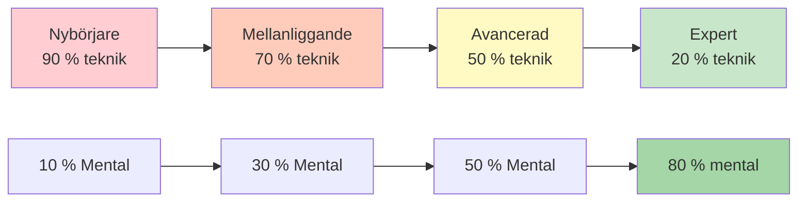

# Teknisk träning kontra flödesträning

Att förstå skillnaden mellan teknisk träning och flowträning är avgörande för elitutveckling. Båda är nödvändiga, men de tjänar olika syften och kräver olika tillvägagångssätt.

::: tip Kärnprincipen
**Du kan inte träna en nybörjare som en expert** (de saknar nervbanor), och **du kan inte träna en expert som en nybörjare** (hög teknisk volym orsakar övertänkande).
:::

## Två typer av träning

::: info Teknisk utbildning (explicit lärande)
**Fokus:** Mekanik och form
**Uppmärksamhet:** Medvetna kroppsrörelser
**Metod:** Nedbrytning av färdigheter, repetitiv övning
**Bäst för:** Att lära sig nya färdigheter, korrigera dåliga vanor, bygga grunder

**Exempel:** Öva din släpppunkt 50 gånger med videoanalys
:::

::: info Flödesträning (Implicit lärande)
**Fokus:** Resultat, inte mekanik
**Uppmärksamhet:** Att låta det undermedvetna ta över
**Metod:** Varierad, spelliknande övning, visualisering
**Bäst för:** Tävlingsförberedelser, bygga upp självförtroende, topprestationer

**Exempel:** Att spela träningsmatcher med press, fokusera endast på måltavlor
:::

## Den dynamiska inversionsmodellen

Rätt träningsförhållande är omvänt korrelerat med teknisk kompetens. Allt eftersom du bemästrar tekniken blir mental träning viktigare – inte mindre.

### 1. Nybörjare (kognitivt stadium)
- Du tänker medvetet på *vad* du ska göra
- Rörelserna känns obekväma och kräver ansträngning
- Hjärnan är helt mättad med mekanik
- **Förhållande:** 90 % teknisk / 10 % mental
- **Mentalt fokus:** Njutning, externt fokus (titta på målet), inte komplex visualisering

### 2. Mellanstadiet (Associativt stadium)
- Du förfinar färdigheten med mindre medveten tanke
- Rörelserna blir smidigare, felen minskar
- Du börjar upptäcka dina egna misstag
- **Förhållande:** 70 % teknisk / 30 % mental
- **Mental fokus:** Utveckla din rutiner före framträdandet (PPR)

### 3. Avancerad (tröskel för autonomi)
- Färdigheten är till stor del automatiserad
- Din självbild släpar ofta efter din fysiska förmåga
- Utbildningen fokuserar på trycksimulering
- **Förhållande:** 50% Teknisk / 50% Mental
- **Mentalt fokus:** Visualisering, självbild, ångestkontroll

### 4. Expert (autonomt stadium)
- Tekniska färdigheter är helt undermedvetna
- Medveten uppmärksamhet på mekanik stör prestandan
- Underhållsvolymen är allt du behöver tekniskt sett
- **Förhållande:** 20 % teknisk / 80 % mental
- **Mentalt fokus:** Flödestillstånd, strategi, att stilla sinnet

## Progressionstabellen

| Nivå | Teknik: Mental | Primärt mål |
|-------|---------------|-------------------|
| Nybörjare | 90 : 10 | Bygg maskinen |
| Mellanliggande | 70:30 | Stabilisera färdigheten |
| Avancerad | 50:50 | Lita på maskinen |
| Expert | 20:80 | Frihet att prestera |

## Expertfällan

För avancerade och experter är det farligt att återgå till högt tekniskt fokus.

**Problemet:** När du har automatiserat en färdighet men medvetet övervakar den under tävling, engagerar du det medvetna sinnet och åsidosätter det undermedvetna. Detta orsakar prestationsångest och &quot;kvävningskänsla&quot;.

**Vetenskapen:** Den volym som krävs för att upprätthålla en färdighet är betydligt lägre (ofta 1/3 till 1/9) än den volym som krävs för att bygga upp den. Experter behöver minimalt med tekniskt arbete för att behålla sin touch.

**Elitexempel:** Mästare som Philippe Quintais och Dylan Rocher fokuserar starkt på taktiska scenarier och kritiska ögonblick snarare än mekaniska övningar.

Tecken på att du övertänker teknik:
- Förlamning genom analys
- Inkonsekvent prestation trots bra teknik
- Sämre resultat i tävling än i träning
- Känsla av &quot;mekanisk&quot; istället för flytande

## Jämförda träningsmetoder

| Aspekt | Teknisk utbildning | Flödesträning |
|--------|-------------------|---------------|
| **Typ av övning** | Blockerad (samma färdighet upprepade gånger) | Slumpmässig (varierade färdigheter) |
| **Feed-back** | Omedelbar, detaljerad | Fördröjd, resultatfokuserad |
| **Miljö** | Kontrollerad, förutsägbar | Variabel, spelliknande |
| **Mentalt tillstånd** | Analytisk, medveten | Intuitiv, automatisk |
| **Bästa tid** | Lågsäsong, färdighetsbyggande | Förberedelser inför tävlingen, underhåll |

## Blockerad vs. slumpmässig övning

**Blockerad övning:** Upprepa samma kast 20 gånger
- Känns produktiv (du ser snabb förbättring)
- Bra för inledande inlärning
- Dålig för långsiktig retention

**Slumpmässig övning:** Variera avstånd, mål och kasttyp
- Känns svårare (fler misstag)
- Bättre för tävlingsöverföring
- Bygger upp anpassningsförmåga och beslutsfattande

## Praktiska riktlinjer

### För tekniska sessioner
1. Fokusera på EN aspekt åt gången
2. Använd videoanalys
3. Få feedback från en coach eller träningspartner
4. Acceptera att det kommer att kännas obekvämt till en början
5. Håll sessionerna kortare (kvalitet framför kvantitet)

### För flödessessioner
1. Skapa spelliknande press
2. Fokusera på målet, inte din kropp
3. Använd din rutin före sprutning konsekvent
4. Analysera inte under sessionen
5. Lita på din träning

## Integrationsutmaningen

Den verkliga skickligheten är att veta när man ska använda varje läge:

**Under en tävlingsmatch:**
- Tekniskt tänkande: ALDRIG under utförande
- Flödesläge: ALLTID vid kastning

**Under träning:**
- Tekniska sessioner: Schemalagda, specifikt fokus
- Flödessessioner: Spelsimulering, tryckövning

## Exempel på veckobalans

| Dag | Sessionstyp | Fokus |
|-----|-------------|-------|
| måndag | Teknisk | Pekningsprecision |
| tisdag | Teknisk | Skottprecision |
| onsdag | Flöde | Mental träning, visualisering |
| torsdag | Blandad | Spelscenarier med fokus på flöde |
| Fredag | Teknisk | Svaghetsområde |
| Lördag | Flöde | Matchspel, tävlingssimulering |
| söndag | Vila | Återhämtning, reflektion |

## Sammanfattning: Regler för träningsbalans

::: tip Regel nr 1: Matcha träningen till nivå
**Nybörjare (90/10):** Bygg maskinen - fokusera på teknik
**Medel (70/30):** Stabilisera färdigheten - lägg till mentalt arbete
**Avancerad (50/50):** Lita på maskinen – balansera båda
**Expert (20/80):** Prestationsfrihet - mestadels mental
:::

::: tip Regel nr 2: Blockerad kontra slumpmässig övning
**Blockerad övning** (samma kast upprepade gånger): Bra för initial inlärning, dålig för att hålla tillbaka
**Slumpmässig övning** (varierade kast): Svårare på övning, bättre på tävling
:::

::: tip Regel nr 3: Expertfällan
**För experter:** Hög teknisk volym orsakar övertänkande och kvävning
**Lösning:** Minimalt tekniskt underhåll, maximal mental träning
:::

## Viktig slutsats

> Du kan inte träna en nybörjare som en expert (de saknar neurala banor för mentalt arbete), och du kan inte träna en expert som en nybörjare (hög teknisk volym orsakar utbrändhet och övertänkande).

Resan från teknik till flöde kräver strategisk inversion. Anpassa din träning till ditt utvecklingsstadium.

