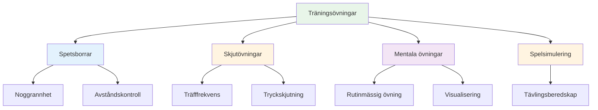

# Träningsövningar

Här är beprövade övningar som används av elitspelare. Varje övning har ett specifikt syfte – välj utifrån vad du behöver utveckla.

::: tip Den stora idén
**Varje övning har ett specifikt syfte.** Kasta inte bara boule slumpmässigt – välj övningar som riktar sig mot dina svagheter och stödjer dina mål. Följ dina framsteg för att se förbättringar.
:::

## Spetsborrar

### Gränden
**Syfte:** Isolera utlösningsvinkel och linjekonsistens

**Inställning:**
- Placera två markörer 30-40 cm från varandra, cirka 1 meter från cirkeln
- Målet är 7–9 meter bort

**Borra:**
- Kasta genom &quot;gränden&quot; (mellan markörerna)
- Varje kast som träffar en markör är &quot;dött&quot;
- Fokusera på en konsekvent utlösningspunkt

**Progression:**
- Begränsa gränden allt eftersom du förbättrar dig
- Variera målavståndet
- Lägg till en specifik landningszon

### Precisionszoner
**Syfte:** Utveckla noggrannhet inom specifika områden

**Inställning:**
- Markera zoner runt ett mål (t.ex. cirklar på 20 cm, 40 cm, 60 cm)
- Eller använd naturliga markörer i terrängen

**Poängsättning:**
- Inuti 20 cm: 3 poäng
- Inuti 40 cm: 2 poäng
- Inuti 60 cm: 1 poäng
- Utanför: 0 poäng

**Borra:**
- Kasta 10 klot, håll koll på din poäng
- Mål: Konsekvent förbättring under sessionerna

### Avståndsvariation
**Syfte:** Utveckla djupkontroll

**Inställning:**
- Placera måltavlor på 6m, 7m, 8m, 9m, 10m

**Borra:**
- Kasta till varje avstånd i slumpmässig ordning
- Partnern ropar ut avståndet
- Fokusera på att justera vikten, inte tekniken

**Variation:**
- Lägg till &quot;korta&quot; och &quot;långa&quot; anrop efter att du släppt
- Måste justeras mitt i flygningen (utvecklar känslan)

## Skjutövningar

### Skjutstegen
**Syfte:** Bygga noggrannhet under progressivt tryck

**Inställning:**
- Placera ett målklot på 6 meters avstånd
- Markera avstånd på 7m, 8m, 9m, 10m

**Borra:**
- Börja på 6 meter
- Träff = flytta tillbaka en meter
- Missa = gå framåt en meter (eller starta om)
- Mål: Nå 10 meter

**Variationer:**
- Strikt version: Varje miss återgår till 6m
- Tidsbegränsad version: Hur långt kan du komma på 10 minuter?
- Lagversion: Växla med partner

### Barriären (Blox)
**Syfte:** Tvinga fram hög ljusbågstagning

**Inställning:**
- Placera en barriär (pinne, snöre eller hinder) mellan dig och målet
- Barriären bör vara tillräckligt hög för att kräva en lobb

**Borra:**
- Måste ta sig över barriären för att träffa målet
- Varje kast som träffar barriären är &quot;dött&quot;
- Utvecklar hög frisättningspunkt

**Varför det är viktigt:**
- Tävling kräver ofta att man skjuter över hinder
- Bygger mångsidighet i ditt skytte

### Hinderbana
**Syfte:** Utveckla skytte från olika vinklar

**Inställning:**
- Placera målklotet i mitten
- Lägg till hinder (andra klot, markörer) runt den

**Borra:**
- Skjut från olika positioner runt cirkeln
- Måste hitta vinkeln som fungerar
- Utvecklar läsning av skjutlinjer

## Mentala träningsövningar

### Rutinmässig upprepning
**Syfte:** Gör din rutin för behandling automatisk

**Borra:**
- Öva hela din rutin utan att kasta
- Gå igenom varje steg medvetet
- Gör 10-20 repetitioner
- Lägg sedan till kastet

**Fokus:**
- Konsekvent timing
- Tydlig övergång från tänkande till genomförande
- Samma rutin varje gång

### Tryckpunkter
**Syfte:** Öva på att prestera under press

**Inställning:**
- Skapa ett &quot;måste-göra&quot;-scenario
- Sätt konsekvenser för att missa

**Exempel:**
- &quot;Gör 3 i rad eller börja om&quot;
- &quot;Miss och gör 10 armhävningar&quot;
- &quot;Meddel ditt mål innan du kastar&quot;

**Nyckel:**
- Pressen ska kännas verklig
- Öva din mentala reaktion på press
- Använd din rutin precis som i tävling

### Återhämtningspraktik
**Syfte:** Bygg upp vanan med snabb mental återställning

**Borra:**
- Avsiktligt kasta ett dåligt klot
- Öva omedelbart SOAS (Stoppa, Observera, Acceptera, Slipa)
- Kasta nästa klot med full engagemang

**Fokus:**
- Uppehåll dig inte vid missen
- Återställ helt före nästa kast
- Behåll ett positivt kroppsspråk

## Spelsimuleringsövningar

### Millieus glädje
**Syfte:** Bryt rytmlåset, bygg upp mångsidighet

**Borra:**
- Växla mellan att peka och skjuta vid varje kast
- Inga två på varandra följande kast av samma typ
- Utvecklar förmågan att byta läge

### Scenariospel
**Syfte:** Öva taktiskt beslutsfattande

**Inställning:**
- Skapa realistiska spelsituationer
- Tilldela poäng och bouleräkningar

**Exempel:**
- &quot;Du ligger under med 10-8, motståndaren har 2 poäng, du har 2 klot&quot;
- &quot;Oavgjort 6-6, ni har sista klotet, de har 1 poäng&quot;

**Borra:**
- Bestäm vad du ska göra
- Utför med fullt engagemang
- Granska beslutet efteråt

### Matchspel med regler
**Syfte:** Tävlingssimulering

**Variationer:**
- Spela till 13 (hela matchen)
- Spela till 7 (kortare, fler spel)
- &quot;Tryckpunkter&quot; - vissa ändar är värda dubbelt
- &quot;Plötslig död&quot; - den som först förlorar en omgång förlorar spelet

## Spåra dina övningar

För en logg för varje övning:

| Datum | Borra | Poäng/Resultat | Anteckningar |
|------|-------|--------------|-------|
| | | | |

**Spåra över tid:**
- Bättrar du dig?
- Vilka övningar hjälper mest?
- Var kämpar du?

## Bygga en övningssession

### Uppvärmning (10 min)
- Enkla kast för att lossa upp
- Ingen press, bara känn

### Tekniskt fokus (20–30 min)
- En eller två övningar som riktar sig mot specifika färdigheter
- Blockerad övning för nya färdigheter
- Slumpmässig övning för etablerade färdigheter

### Tryck-/Spelsimulering (20–30 min)
- Lägg till konsekvenser
- Skapa realistiska scenarier
- Öva mentala färdigheter

### Nedvarvning (10 min)
- Enkla kast
- Reflektera över sessionen
- Notera vad du ska arbeta med härnäst

## Viktig slutsats

> Borrar är verktyg. Välj rätt verktyg för det du behöver bygga.

Kasta inte bara boule. Träna med syfte.

