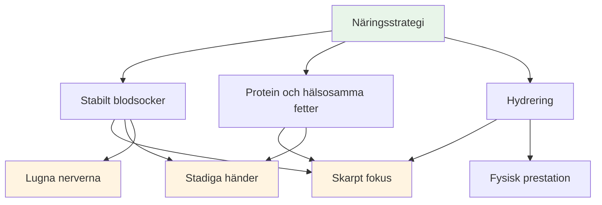
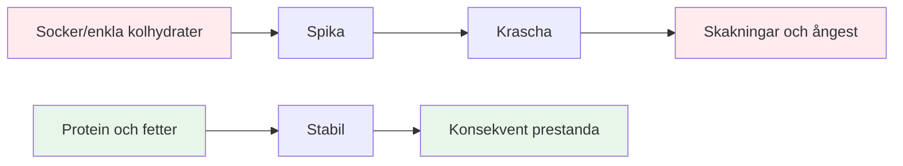
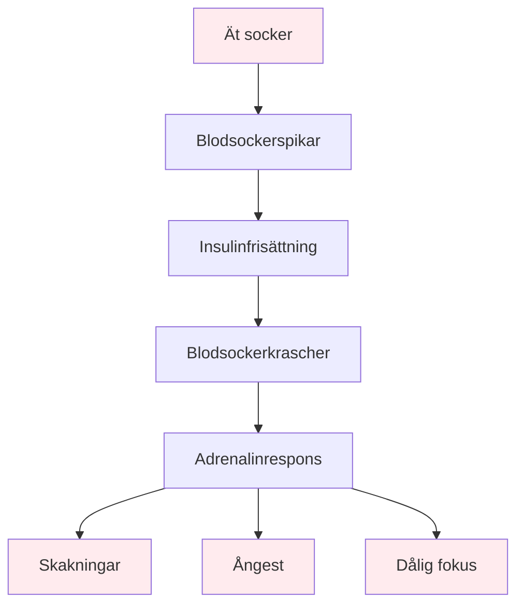

# Mat och näring

## Drivkraft för precisionsprestanda

Boule är en precisionssport. Din hjärna är ditt viktigaste verktyg – ge den stabil bränsle, inte berg-och-dalbaneenergi.

::: tip Kärnprincipen
**Stabilt blodsocker = Skarpt fokus + Stadiga händer**

Undvik sockertoppar. Prioritera protein och hälsosamma fetter. Håll dig hydrerad.
:::

## Viktiga principer

### Stabilt blodsocker är allt

::: warning Blodsockerkraschers inverkan
Socker och enkla kolhydrater orsakar blodsockertoppar och -krascher, vilket direkt påverkar:
- ❌ Mental fokus och klarhet
- ❌ Stadiga händer (skakningar från blodsockerfall)
- ❌ Beslutsfattandekvalitet
- ❌ Emotionell stabilitet och lugn
:::

### Prioritera protein och hälsosamma fetter

::: tip Bästa maten för precision
Fett och protein ger långvarig energi utan kraschar:
- ✅ Nötter, avokado, olivolja, ägg, ost
- ✅ Långsam matsmältning = jämn energi hela dagen
- ✅ Ingen eftermiddagssvängning under långa turneringar
:::

### Undvik sockerfällan

::: danger Livsmedel att undvika
Var särskilt försiktig med:
- ❌ &quot;Energi&quot;-barer och drycker (ofta sockerrika)
- ❌ Fruktjuice och smoothies (koncentrerat socker)
- ❌ Vitt bröd, bakverk, snacks från varuautomater
:::

## Snabbguide för tävlingsdagen

| Tidpunkt | Vad man ska äta | Varför |
|--------|-------------|-----|
| **2–3 timmar innan** | Balanserad måltid: protein, fett, grönsaker | Stabil energi utan dåsighet |
| **Under tävling** | Vatten + små proteinsnacks (nötter, ost, jerky) | Behåll fokus och stadiga händer |
| **Undvik hela dagen** | Sockrade snacks och drycker | Förhindra krascher och skakningar |

::: tip Snabba tävlingssnacks
**Ta med dig dessa:**
- Blandade nötter (osaltade)
- Hårdkokta ägg
- Ostbitar
- Jerky nötkött eller kalkon
- Grönsaker med hummus

**Lämna dessa hemma:**
- Godis och choklad
- Energidrycker
- Bakverk
- Fruktjos
:::

## Vetenskapen

::: info Varför detta är viktigt för boule
Till skillnad från uthållighetssporter kräver petanque:
- **Precision** - Stadiga händer, inga skakningar
- **Mental klarhet** - Skarpt beslutsfattande hela dagen
- **Lugna nerver** - Låg ångest under press

Sockerbaserad energi motverkar alla dessa.
:::

## Läs mer

För detaljerade näringsstrategier, tävlingsdagsprotokoll och vetenskapen bakom stabil energi:

::: tip Komplett näringsguide
→ **[Näring för precisionsprestanda](./education/nutrition/)** - Komplett guide i vår utbildningssektion

Innehåller:
- Detaljerad måltidsplanering
- Protokoll för tävlingsdagen
- Lågkolhydratalternativet för precisionsidrottare
- Vätskehanteringsstrategier
- Mat som hjälper kontra mat som skadar
:::

