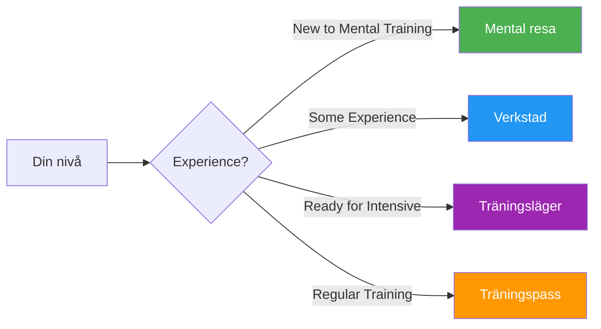

# Guider och verktyg

Praktiska resurser för spelare, tränare och klubbar för att implementera strukturerade mentala träningsprogram.

## Välj ditt format

## Guideformat

### 🌱 [Mental resa](/sv/guider/mental-resa/)
**För nybörjare** — 2–3 timmars introduktion

Perfekt för spelare som är nya inom mental träning. En skonsam introduktion till kärnkoncepten med praktiska övningar.

- Längd: 2–3 timmar
- Gruppstorlek: 4–12 spelare
- Material: Tillhandahålls
- [Visa guide →](/sv/guider/mental-resa/)

---

### 🎯 [Workshop](/sv/guider/workshop/)
**För medelnivå** — 3–4 timmars djupdykning

Strukturerat workshopformat för klubbar och lag som vill utforska mental träning mer seriöst.

- Längd: 3–4 timmar
- Gruppstorlek: 6-8 spelare
- Innehåller: Samordnarhandledning + nedladdningsbart material
- [Visa guide →](/sv/guider/verkstad/)

---

### 🏕️ [Träningsläger](/sv/guider/träningsläger/)
**För engagerade team** — Helgintensivkurs

Helhelgsprogram som blandar teori, praktik och tävling. Perfekt för lag som förbereder sig inför viktiga turneringar.

- Varaktighet: 2–3 dagar
- Gruppstorlek: 10–20 spelare
- Inkluderar: Fullständigt program + organiseringsmaterial
- [Visa guide →](/sv/guider/träningsläger/)

---

### 🔄 [Träningspass](/sv/guider/träningspass/)
**För regelbunden träning** — 2–4 timmars strukturerade sessioner

Ramverk för regelbundna träningspass som integrerar mentala färdigheter tillsammans med teknisk övning.

- Längd: 2–4 timmar
- Gruppstorlek: 4 spelare (ett lag)
- Fokus: Tävlingssimulering med reflektion
- [Visa guide →](/sv/guider/träningssession/)

---

## Mallar och verktyg

Nedladdningsbara mallar som stödjer din utveckling:

### 📋 [Målmall](/sv/guider/mallar/målmall)
Strukturerat arbetsblad för att sätta och följa upp dina boulemål med hjälp av SMART-ramverket.

### 📓 [Dagboksmall](/sv/guider/mallar/dagboksmall)
Mall för tränings- och tävlingsdagbok för att följa framsteg, insikter och förbättringsområden.

---

## Vilket format är rätt för dig?

| Formatera | Bäst för | Tidsåtagande | Djup |
|--------|----------|-----------------|-------|
| **Mental resa** | Första introduktionen | 2–3 timmar | ⭐ |
| **Verkstad** | Klubbens träningsdagar | 3–4 timmar | ⭐⭐ |
| **Träningsläger** | Lagförberedelser | Helgen | ⭐⭐⭐ |
| **Träningspass** | Pågående utveckling | Regelbunden 2–4 timmar | ⭐⭐ |

::: tip För tränare och klubbledare
Varje guide innehåller material för både deltagare OCH handledare/organisatörer. Leta efter avsnittet &quot;För koordinatorer&quot; med nedladdningsbara PDF-filer och presentationsbilder.
:::

## Relaterade resurser

- [🎯 Bedömning](/sv/bedömning/) — Utvärdera dina 8 faktorer och hitta prioriteringar
- [📚 Education Hub](/sv/utbildning/) — Djupdyk i de 8 prestationsfaktorerna
- [📝 Artiklar](/sv/artiklar/) — Forskning och insikter

