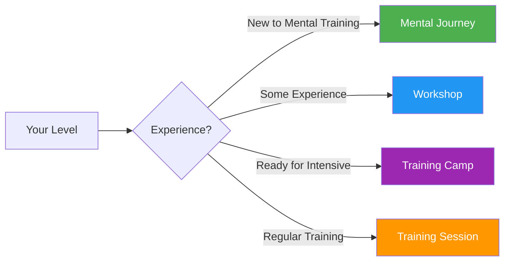

# Guides & Tools

Practical resources for players, coaches, and clubs to implement structured mental training programs.

## Choose Your Format

## Guide Formats

### 🌱 [Mental Journey](/sv/guides/mental-journey/)
**For Beginners** — 2-3 hour introduction

Perfect for players new to mental training. A gentle introduction to the core concepts with practical exercises.

- Duration: 2-3 hours
- Group size: 4-12 players
- Materials: Provided
- [View Guide →](/sv/guides/mental-journey/)

---

### 🎯 [Workshop](/sv/guides/workshop/)
**For Intermediate** — 3-4 hour deep-dive

Structured workshop format for clubs and teams wanting to explore mental training more seriously.

- Duration: 3-4 hours
- Group size: 6-8 players
- Includes: Coordinator guide + downloadable materials
- [View Guide →](/sv/guides/workshop/)

---

### 🏕️ [Training Camp](/sv/guides/training-camp/)
**For Committed Teams** — Weekend intensive

Full weekend program mixing theory, practice, and competition. Ideal for teams preparing for important tournaments.

- Duration: 2-3 days
- Group size: 10-20 players
- Includes: Full program + organizer materials
- [View Guide →](/sv/guides/training-camp/)

---

### 🔄 [Training Session](/sv/guides/training-session/)
**For Regular Practice** — 2-4 hour structured sessions

Framework for regular training sessions that incorporate mental skills alongside technical practice.

- Duration: 2-4 hours
- Group size: 4 players (one team)
- Focus: Competition simulation with reflection
- [View Guide →](/sv/guides/training-session/)

---

## Templates & Tools

Downloadable templates to support your development:

### 📋 [Goal Template](/sv/guides/templates/goal-template)
Structured worksheet for setting and tracking your pétanque goals using the SMART framework.

### 📓 [Diary Template](/sv/guides/templates/diary-template)
Training and competition diary template for tracking progress, insights, and areas for improvement.

---

## Which Format Is Right for You?

| Format | Best For | Time Commitment | Depth |
|--------|----------|-----------------|-------|
| **Mental Journey** | First introduction | 2-3 hours | ⭐ |
| **Workshop** | Club training days | 3-4 hours | ⭐⭐ |
| **Training Camp** | Team preparation | Weekend | ⭐⭐⭐ |
| **Training Session** | Ongoing development | Regular 2-4h | ⭐⭐ |

::: tip For Coaches & Club Leaders
Each guide includes materials for both participants AND facilitators/organizers. Look for the "For Coordinators" sections with downloadable PDFs and presentation slides.
:::

## Related Resources

- [🎯 Assessment](/sv/assessment/) — Evaluate your 8 factors and find priorities
- [📚 Education Hub](/sv/education/) — Deep-dive into the 8 performance factors
- [📝 Articles](/sv/articles/) — Research and insights

