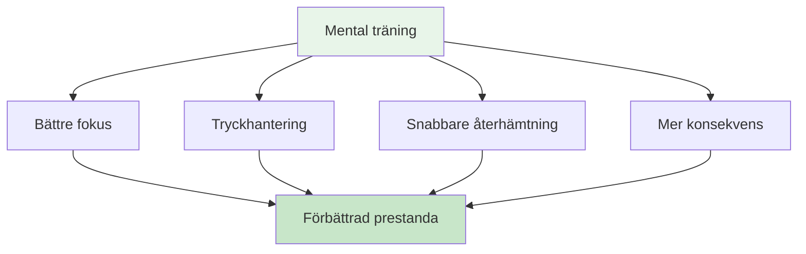

# Mental resa för nybörjare

## Välkommen till din mentala spelresa

Oavsett om du är en spelare som vill förbättra ditt mentala spel eller en tränare som vill introducera mental träning i ditt lag, kommer den här guiden att hjälpa dig att ta de första stegen in i världen av idrottspsykologi för boule.

::: tip Vem är detta för?
- **Spelare** som vill förstå det mentala spelet
- **Tränare** introducerar mental träning till sina lag
- **Klubbar** som anordnar workshops i mentala spel
- **Någon** som är nyfiken på boulepsykologin
:::

## Snabbåtkomst

| Resurs | Ändamål | Tillträde |
|----------|---------|--------|
| **Komma igång** | Introduktion till mentala spelkoncept | [Läs nedan](#varför-mental-träning-är-viktigt) |
| **Sessionsguide** | Komplett 2-3 timmars workshopguide för handledare | [Visa guide](/sv/guider/mental-resa/sessionsguide) |
| **Material** | Deltagarguider, bilder och arbetsblad | [Visa material](/sv/guider/mental-resa/material) |
| **Relaterade guider** | Avancerade format | [Workshop](/sv/guider/workshop/) • [Träningsläger](/sv/guider/träningsläger/) |

## Varför mental träning är viktig

På alla nivåer av boule påverkar ditt sinne din prestation. Men de flesta spelare fokuserar 90 % på teknik och bara 10 % på mentala färdigheter. Den här guiden hjälper dig att börja balansera den ekvationen.

## Vad du kommer att lära dig

### För spelare

**Kärnbegrepp:**
1. **Zonen** - Förstå flödestillstånd och hur man får tillgång till dem
2. **Den inre kritikern** - Att känna igen och hantera negativt självprat
3. **Tryckrespons** - Varför du spelar annorlunda i tävling
4. **Omkopplaren** - Att gå från tänkande till handling

**Praktiska färdigheter:**
- Enkel rutin före skotttagning
- 3-andetagsåterställningsteknik
- Protokoll för felåterställning
- Fokusankare för tävling

### För tränare/guider

**Hur man underlättar:**
1. Skapa psykologisk trygghet
2. Att leda gruppdiskussioner
3. Att koppla teori till praktik
4. Att hantera olika personligheter

**Sessionsstruktur:**
- Workshopformat 2–3 timmar
- Diskussionsuppmaningar och övningar
- Nedladdningsbart material
- Uppföljningsaktiviteter

## Komma igång

### Alternativ 1: Självstudier (för spelare)

**Vecka 1: Förstå grunderna**
1. Läs modulen [Zonen](/sv/utbildning/mentalt-spel/zonen/)
2. Prova 3-andetagsåterställningstekniken
3. Lägg märke till när du är i &quot;tekniskt läge&quot; kontra &quot;flödesläge&quot;

**Vecka 2: Bygga medvetenhet**
1. Läs modulen [Mental styrka](/sv/utbildning/mentalt-spel/mental-styrka/)
2. Identifiera dina inre kritikmönster
3. Öva neutral observation efter misstag

**Vecka 3: Skapa struktur**
1. Läs modulen [Mindfulness](/sv/utbildning/mentalt-spel/mindfulness/)
2. Börja med 5-minuters daglig träning
3. Utveckla en enkel rutin före skotttagning

**Vecka 4: Integration**
1. Använd din rutin i praktiken
2. Följ mental prestation i [Dagboksmall](/sv/guider/mallar/dagboksmall)
3. Sätt mentala spelmål med hjälp av [Målmall](/sv/guider/mallar/målmall)

### Alternativ 2: Gruppworkshop (för coacher)

**Genomför en 2–3 timmars session:**

Använd vår omfattande [Sessionsguide](/sv/guider/mental-journey/sessionsguide) som inkluderar:
- Komplett sessionsstruktur
- Diskussionsuppmaningar
- Gruppövningar
- Nedladdningsbart material

**Vad du behöver:**
- 6–12 deltagare
- Tyst rum med sittplatser i cirkel
- Whiteboard eller blädderblock
- Skärm eller projektor för att dela material
- 2–3 timmars oavbruten tid

## De tre pelarna inom mental träning

### 1. Medvetenhet
**Vad det är:** Att lägga märke till dina tankar, känslor och mönster

**Varför det är viktigt:** Du kan inte ändra det du inte märker

**Hur man utvecklar:**
- Daglig mindfulnessövning (5–10 minuter)
- Reflektion efter matchen
- Att föra träningsdagbok

### 2. Godkännande
**Vad det är:** Att tillåta tankar och känslor utan att döma

**Varför det är viktigt:** Att kämpa mot sin inre upplevelse skapar spänning

**Hur man utvecklar:**
- Neutral observationspraxis
- Inre coach kontra inre kritikerarbete
- Att släppa taget om perfektionismen

### 3. Åtgärd
**Vad det är:** Att välja hjälpsamma svar trots svåra tankar

**Varför det är viktigt:** Mental träning handlar om att prestera bra trots nervositet

**Hur man utvecklar:**
- Rutiner före skotttagning
- Återställ protokoll
- Trycksimulering i träning

## Vanliga frågor

### &quot;Jag är inte tillräckligt bra för att oroa mig för mental träning&quot;
Mental träning hjälper på alla nivåer. Att börja tidigt bygger faktiskt bättre vanor. Du behöver inte vara elit för att dra nytta av att förstå ditt sinne.

### &quot;Är inte det här bara att &#39;tänka positivt&#39;?&quot;
Nej. Mental träning handlar om att prestera bra trots negativa tankar, inte att eliminera dem. Det är praktiska färdigheter, inte positivt tänkande.

### &quot;Hur lång tid tar det att se resultat?&quot;
Vissa tekniker (som 3-andetagsåterställningen) fungerar omedelbart. Djupare förändringar (som konstanta flödestillstånd) tar 2–3 månaders övning.

### &quot;Behöver jag en idrottspsykolog?&quot;
Inte nödvändigtvis. Den här guiden ger praktiska verktyg som du kan använda omedelbart. Professionell hjälp är värdefull för djupare problem, men de flesta spelare kan börja på egen hand.

### &quot;Kommer detta att hjälpa min teknik?&quot;
Mental träning ersätter inte teknisk övning. Men den hjälper dig att konsekvent använda din teknik, särskilt under press.

## Tillgängliga resurser

### För spelare
- [Utbildningsmoduler](/sv/utbildning/) - 8 omfattande guider
- [Målmall](/sv/guider/mallar/målmall) - Strukturera din utveckling
- [Dagboksmall](/sv/guider/mallar/dagboksmall) - Följ dina framsteg
- [Fallstudier](/sv/artiklar/fallstudier) - Verkliga exempel

### För tränare/guider
- [Sessionsguide](/sv/guider/mental-resa/sessionsguide) - Komplett 2-3 timmars workshop
- [Handledarens material](/sv/guider/mental-resa/material) - Digitala guider och bilder
- [Workshopguide](/sv/guider/workshop/) - Avancerat 3-4 timmars format
- [Träningslägerguide](/sv/guider/träningsläger/) - Helgprogram

## Nästa steg

### För individuella spelare
1. **Börja med medvetenhet** - Läs [Zonen](/sv/utbildning/mentalt-spel/zonen/)
2. **Prova en teknik** - Använd 3-andetagsåterställningen den här veckan
3. **Spåra din upplevelse** - Lägg märke till vilka förändringar
4. **Bygg gradvis** - Lägg till en ny färdighet per vecka

### För tränare/grupper
1. **Gå igenom sessionsguiden** - Förstå strukturen
2. **Ladda ner material** - Få utdelningsblad och bilder
3. **Boka en session** - Block 2-3 timmar
4. **Förbered dig** - Läs handledarens anteckningar
5. **Hör workshopen** - Följ guiden

## Stöd

**Frågor om att komma igång?**
- E-post: [patrik.wiik@gmail.com](mailto:patrik.wiik@gmail.com)
- Granska [Fallstudier](/sv/artiklar/fallstudier) för exempel
- Delta i diskussionerna i din klubb

---

::: tip Redo att börja?
**Spelare:** Börja med modulen [Zonen](/sv/utbildning/mentalt-spel/zonen/)

**Coacher:** Gå till [Sessionsguide](/sv/guider/mental-journey/sessionsguide)

**Ladda ner material:** Besök [Handledarens material](/sv/guider/mental-resa/material)
:::

