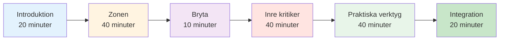

# Sessionsguide: Introduktion till mentala spel (2–3 timmar)


## Översikt

Den här guiden hjälper dig att genomföra en 2–3 timmar lång introduktionssession i mental spelträning för boulespelare. Perfekt för tränare, klubbledare eller erfarna spelare som vill introducera mental träning till sitt lag.

::: tip Två avsnitt i den här guiden
- **[För deltagare](#för-deltagare)** - Vad spelarna kommer att lära sig
- **[För handledare](#för-handledare)** - Hur man genomför sessionen
:::

## Snabbåtkomst

| Avsnitt | Ändamål | Tillträde |
|---------|---------|--------|
| **För deltagare** | Vad du kan förvänta dig av sessionen | [Visa avsnitt](#för-deltagare) |
| **För handledare** | Komplett sessionsplan och tidsplan | [Visa avsnitt](#för-handledare) |
| **Material för sessionen** | Guider, bilder och arbetsblad | [Visa material](/sv/guides/mental-journey/material) |
| **Förberedelsechecklista** | Vad man ska förbereda inför sessionen | [Visa checklista](#förberedelse-1-vecka-innan) |

---

## För deltagare

### Vad man kan förvänta sig

Den här sessionen introducerar det mentala spelet boule genom diskussioner, övningar och praktiska tekniker som du kan använda direkt.

**Du kommer att lära dig:**
- Varför mental träning är viktig för prestation
- Skillnaden mellan &quot;tekniskt läge&quot; och &quot;flödesläge&quot;
- Hur man känner igen och hanterar sin inre kritiker
- Enkla tekniker för tryckhantering
- En grundläggande rutin före skotttagning

**Vad du behöver:**
- Öppet sinne och vilja att dela med sig
- Anteckningsbok och penna
- Dina egna erfarenheter att diskutera
- 2-3 timmars fokuserad tid

### Sessionsstruktur



### Viktiga begrepp du kommer att utforska

#### 1. Zonen (flödesstatus)
- Hur det känns när allt klickar
- Varför tänkande på teknik stör prestationen
- &quot;Övergången&quot; från planering till utförande

#### 2. Den inre kritikern
- Hur negativt självprat påverkar prestationen
- Skillnaden mellan en inre kritiker och en inre coach
- Neutral observation kontra hård bedömning

#### 3. Tryckrespons
- Varför du spelar annorlunda i tävling
- Fysiska tecken på tryck
- Snabba återställningstekniker

#### 4. Praktiska verktyg
- 3-andetagsåterställning
- Enkel rutin före skotttagning
- Protokoll för felåterställning

### Vad man ska ta med sig

**Nödvändig:**
- Du själv och dina erfarenheter
- Villighet att delta

**Frivillig:**
- Exempel på mentala utmaningar du står inför
- Frågor om specifika situationer
- Anteckningsblock för personliga anteckningar

### Efter sessionen

Du får:
- Sammanfattning av nyckelbegrepp
- Övningsövningar för veckan
- Länkar till detaljerade utbildningsmoduler
- Målmall för mental spelutveckling


---

## För handledare

### Förberedelsechecklista

**1 vecka innan:**
- [ ] Boka rum i 2-3 timmar
- [ ] Bjud in 6–12 deltagare
- [ ] Bokmärk materialsidor (se [Material](/sv/guides/mental-journey/materials))
- [ ] Läs igenom den här guiden noggrant
- [ ] Förbered flipchart eller whiteboard

**1 dag före:**
- [ ] Bekräfta närvaro
- [ ] Uppställningsrum (cirkelsittande)
- [ ] Testa all teknik (bilder etc.)
- [ ] Förbered material

**1 timme före:**
- [ ] Anländ tidigt
- [ ] Arrangera sittplatser i cirkel
- [ ] Ställ in material
- [ ] Centrera dig själv

### Din roll som handledare

::: warning Viktig
Du är **inte** en terapeut eller teknisk coach. Du är en **handledare** som:
- Guidediskussion
- Skapar tryggt utrymme
- Kopplar samman koncept med upplevelse
- Hanterar gruppdynamik
:::

**Nyckelfärdigheter:**
- Aktivt lyssnande
- Neutral närvaro
- Att hantera olika personligheter
- Att veta när man ska gå vidare

### Detaljerad sessionsplan

---

#### Del 1: Introduktion (20 minuter)

**Mål:**
- Skapa psykologisk trygghet
- Sätt förväntningar
- Bygg gruppanslutning

**Manus:**

&quot;Välkomna allihopa. Den här sessionen handlar om det mentala spelet boule – tankarna, känslorna och mönstren som påverkar din prestation.&quot;

**Grundregler:**
1. Det som delas här stannar här
2. Ingen bedömning av andras erfarenheter
3. Deltagande är frivilligt
4. Det finns inga fel svar

**Snabbrunda:** Namn, hur länge du har spelat, en mental utmaning du står inför.

**Anteckningar till handledaren:**
- Gå först till att modellera sårbarhet
- Håll introduktionerna korta (1 minut vardera)
- Lägg märke till vanliga teman
- Validera alla svar

---

#### Del 2: Zon-/flödestillståndet (40 minuter)

**Mål:**
- Förstå flödestillstånd
- Känna igen tekniskt kontra flödesläge
- Lär dig konceptet &quot;switch&quot;

**Inledande fråga:**
&quot;Tänk på en gång när du spelade din bästa boule. Hur kändes det? Vad var annorlunda?&quot;

**Diskussionsfrågor:**
1. &quot;Hur många av er har haft spel där allt bara klickade?&quot;
2. &quot;Vad tänkte du på under de stunderna?&quot;
3. &quot;Hur skiljer det sig från när du kämpar?&quot;

**Viktiga undervisningspunkter:**

Använd whiteboardtavlan för att rita:
```
PLANNING MODE          →    EXECUTION MODE
(Outside circle)            (Inside circle)
- Analyze situation         - Eyes on target
- Choose strategy           - Trust training
- Decide throw type         - Automatic movement
```

**Övning: Växeln (10 minuter)**

&quot;Låt oss öva på växlingsögonblicket:&quot;
1. Stå upp
2. Tänk dig att du är utanför cirkeln - tänk på ett skott
3. Ta ett andetag
4. Gå framåt (in i den imaginära cirkeln)
5. Släpp analysen när du kliver framåt
6. Fokusera bara på ett imaginärt mål&quot;

**Avrapportering:**
- &quot;Vad lade du märke till?&quot;
- &quot;Var det lätt eller svårt att släppa taget om tankarna?&quot;
- &quot;Hur kan detta gälla i riktiga spel?&quot;

---

#### Del 3: Paus (10 minuter)

**Handledarens åtgärder:**
- Uppmuntra informell diskussion
- Lägg märke till gruppenergi
- Förbered dig för nästa avsnitt

---

#### Del 4: Den inre kritikern (40 minuter)

**Mål:**
- Känna igen negativa självpratmönster
- Skilj på inre kritiker från inre coach
- Öva neutral observation

**Öppning:**
&quot;Vi har alla en inre röst som kommenterar våra prestationer. Ibland är det hjälpsamt, ibland är det hårt. Låt oss utforska det.&quot;

**Övning: Inre kritikerinventering (15 minuter)**

&quot;Skriv ner på ditt papper:
1. Vad din inre röst säger efter ett dåligt kast
2. Vad det säger när du är under press
3. Vad det säger om dina förmågor&quot;

*Ge 5 minuter för skrivandet*

&quot;Nå, vem är villig att dela med sig av ett exempel?&quot;

**Anteckningar till handledaren:**
- Normalisera hårt självprat
- Försök inte &quot;fixa&quot; någon
- Leta efter vanliga mönster

**Undervisning: Inre kritiker vs. Inre coach (15 minuter)**

Rita två kolumner på whiteboardtavlan:

| Inre kritiker | Inre tränare |
|--------------|-------------|
| &quot;Hur kunde du missa det?!&quot; | &quot;Det gick åt vänster&quot; |
| &quot;Du kvävs alltid&quot; | &quot;Vi försöker igen&quot; |
| &quot;Du är hemsk&quot; | &quot;Vad kan jag lära mig?&quot; |

**Diskussion:**
- &quot;Märker du skillnaden?&quot;
- &quot;Vilken röst hjälper framträdandet?&quot;
- &quot;Kan du ändra rösten?&quot;

**Övning: Omformulering (10 minuter)**

&quot;Ta ett av dina uttalanden från den inre kritikern. Hur skulle en inre coach uttrycka det?&quot;

Dela exempel.

---

#### Del 5: Praktiska verktyg (40 minuter)

**Mål:**
- Lär dig 3-andetagsåterställning
- Skapa en enkel rutin före skotttagning
- Förstå felåterställning

**Verktyg 1: Återställning av 3 andetag (10 minuter)**

&quot;Det här är din nödåterställningsknapp. Använd den när du känner att trycket ökar.&quot;

**Demonstrera:**
1. Andas in i 4 räkningar
2. Håll i 2 räkningar
3. Andas ut i 6 räkningar
4. Upprepa 3 gånger

&quot;Låt oss öva tillsammans nu.&quot;

*Leda gruppen genom 3 cykler*

**Avrapportering:**
- &quot;Vad märkte du i din kropp?&quot;
- &quot;När kan du använda detta?&quot;

**Verktyg 2: Enkel rutin före fotografering (15 minuter)**

&quot;En rutin hjälper dig att konsekvent växla från planering till genomförande.&quot;

**Grundläggande struktur:**
```
Outside Circle (Planning):
- Look at situation
- Decide on throw
- See the result in your mind

Walking to Circle (Transition):
- One deep breath
- Let go of analysis

Inside Circle (Execution):
- Eyes on target only
- Trust your training
- Execute
```

**Utöva:**
&quot;Skapa din egen 3-stegsrutin. Skriv ner den.&quot;

Dela exempel.

**Verktyg 3: Protokoll för felsökning (15 minuter)**

&quot;Elitspelare gör inte färre misstag. De återhämtar sig snabbare.&quot;

**3-stegsprotokoll:**
1. **Observera** - Ange faktum neutralt (&quot;Det gick åt vänster&quot;)
2. **Lär dig** - Extrahera information (&quot;Vinden är starkare än jag trodde&quot;)
3. **Återställning** - Gå framåt (3-andetagsåterställning, blicken framåt)

**Öva:**
&quot;Tänk på ett misstag du nyligen begick. Gå igenom de tre stegen.&quot;

---

#### Del 6: Integration och avslutning (20 minuter)

**Mål:**
- Konsolidera lärandet
- Skapa handlingsplaner
- Tillhandahåll resurser

**Reflektionsfrågor:**
1. &quot;Vilken insikt tar du med dig?&quot;
2. &quot;Vad är en sak du ska prova den här veckan?&quot;
3. &quot;Vilka frågor återstår?&quot;

**Handlingsplanering (10 minuter)**

&quot;På ditt utdelningsblad, skriv:
1. En teknik du ska öva på den här veckan
2. När/var du ska öva på det
3. Hur du kommer att följa dina framsteg&quot;

**Resurser:**
- Dela ut sammanfattningsblad
- Dela webbplatsen: carreau.app
- Rekommenderad startmodul: [Zonen](/sv/education/mental-game/the-zone/)

**Slutningscirkel:**
&quot;Ett ord som beskriver hur du känner dig just nu.&quot;

**Slutord:**
&quot;Mental träning är en färdighet som alla andra – det kräver övning. Börja i liten skala, ha tålamod med dig själv och lägg märke till vad som förändras. Tack för din öppenhet idag.&quot;

---

### Tips för handledare

#### Hantera svåra situationer

**Om någon dominerar:**
- &quot;Tack [namn]. Låt oss höra från andra.&quot;
- Använd strukturerad turtagning

**Om någon är motståndskraftig:**
- Argumentera inte
- &quot;Det är ett giltigt perspektiv. Vad tycker andra?&quot;
- Anpassa sig till deras oro

**Om någon blir känslosam:**
- Normalisera det
- &quot;Det här berör något verkligt. Tack för att du delar med dig.&quot;
- Försök inte att fixa

**Om diskussionen stannar av:**
- Använd specifika uppmaningar
- Dela ditt eget exempel
- Gå till en övning

#### Energihantering

**Hög energi:** Använd övningar och rörelse
**Låg energi:** Ställ provocerande frågor
**Spridda:** Återställ till strukturen
**Spänt:** Använd humor eller paus

### Efter sessionen

**Uppföljning:**
- Skicka sammanfattningsmejl inom 24 timmar
- Inkludera länkar till resurser
- Erbjud dig att svara på frågor
- Schemalägg valfri uppföljningssession

**Självreflektion:**
- Vad fungerade bra?
- Vad skulle du ändra?
- Vad överraskade dig?
- Vad lärde du dig?


---

## Material

- [Deltagarguide](/sv/mental-resa/material#deltagarguide)
- [Handledarens bilder](/sv/guides/mental-journey/material#handledarens-bilder)
- [Sammanfattningsblad](/sv/mental-resa/material#sammanfattningsblad)
- [Övningsblad](/sv/mental-resa/material#övningsblad)

---

::: tip Redo att underlätta?
1. Läs igenom den här guiden noggrant
2. Ladda ner material
3. Öva på övningarna själv
4. Schemalägg din session
5. Lita på processen
:::

