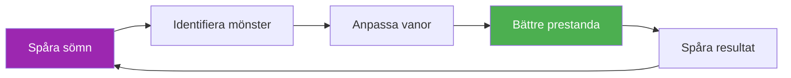

# Mall för sömnspårning

> &quot;Spelaren som sov bättre vinner ofta.&quot;

Spåra dina sömnmönster och korrelera dem med prestation för att optimera återhämtningen.

::: tip Varför spåra sömn?
**Sömn är det främsta återhämtningsverktyget.** Elitidrottare som regelbundet mäter sömn rapporterar bättre energi, snabbare reaktionstider och förbättrat beslutsfattande under press.
:::

---

## Snabb daglig inmatning

### Kopiera detta för varje dag

---

**Datum:** ________

| **Sovdags:** ________ | **Väckningstid:** ________ |
**Total sömn:** ________ timmar

**Sömnkvalitet (1–10):** _____

**Faktorer som påverkar sömnen:**
- [ ] Koffein efter 14:00
- [ ] Alkohol
- [ ] Skärmtid före sänggåendet
- [ ] Stress/oro
- [ ] Buller/ljusstörningar
- [ ] Temperaturproblem
- [ ] Sen måltid
- [ ] Annat: ________

**Morgonenergi (1-10):** _____

**Anteckningar:**

---

## Veckovis sömnsammanfattning

### Kopiera detta varje vecka

---

**Vecka:** ________

| Dag | Läggdags | Vakna | Timmar | Kvalitet | Energi | Anteckningar |
|-----|---------|------|-------|---------|--------|-------|
| mån | /10 | /10 |
| Tis | /10 | /10 |
| ons | /10 | /10 |
| tors | /10 | /10 |
| fre | /10 | /10 |
| lör | /10 | /10 |
| Solen | /10 | /10 |

| **Veckovis genomsnitt:** _____ timmar | Kvalitet: _____/10 | Energi: _____/10 |

**Bästa kvällen:** ________ Varför? ________

**Värsta natten:** ________ Varför? ________

**Mönster observerat:**

---

## Sömnprotokoll före tävling

### 3 dagar före tävling

| Natt | Målsättning för läggdags | Faktisk | Timmar | Kvalitet | Anteckningar |
|-------|----------------|--------|-------|---------|-------|
| -3 dagar |
| -2 dagar |
| -1 dag |

**Energi på tävlingsdagen (1-10):** _____

**Prestandakorrelation:**
- Påverkade sömnen mitt spelande? Ja / Nej / Kanske
- Hur?

---

## Checklista för sömnmiljö

Betygsätt din sömnmiljö:

| Faktor | Poäng (1-10) | Behövs förbättring? |
|--------|--------------|---------------------|
| **Mörker** |
| **Temperatur** (idealiskt 16–19 °C) |
| **Bullernivå** |
| **Madrasskomfort** |
| **Kuddstöd** |
| **Luftkvalitet** |
| **Telefon ut ur rummet** |

---

## Sömnhygienvanor

Spåra vilka vanor du följer:

### Kvällsrutin (2 timmar före sänggåendet)

- [ ] Inget koffein efter 14:00
- [ ] Ingen alkohol (eller begränsat till 1 drink, 3+ timmar före sänggåendet)
- [ ] Lätt middag, inte för sent
- [ ] Dimma lampor i hemmet
- [ ] Ingen intensiv träning
- [ ] Skärmförbud (1 timme före sänggåendet)
- [ ] Avslappningsaktivitet (läsning, stretching, andning)

### Sovrumsregler

- [ ] Rumstemperatur 16–19 °C
- [ ] Fullständigt mörker (eller sömnmask)
- [ ] Telefonen på ljudlös, med framsidan nedåt (eller utanför rummet)
- [ ] Konsekvent sänggående (±30 min)
- [ ] Endast säng för sömn (inte arbete/skrollning)

**Vanor jag följt denna vecka:** _____/12

---

## Sömn- och prestationskorrelation

Följ över 4 veckor för att se mönster:

| Vecka | Genomsnittlig sömn | Genomsnittlig kvalitet | Träningsprestanda | Tävlingsresultat |
|------|-----------|-------------|---------------------|-------------------|
| 1 | timmar | /10 | /10 |
| 2 | timmar | /10 | /10 |
| 3 | timmar | /10 | /10 |
| 4 | timmar | /10 | /10 |

**Korrelation upptäckt:**

---

## Reseprotokoll för sömn

För bortamatcher:

**Innan resan:**
- [ ] Justera läggdagstiden 30 minuter tidigare/senare för tidszon
- [ ] Packa sömnartiklar (mask, öronproppar, kudde)
- [ ] Boka tyst rum (borta från hiss/gata)

**Vid destinationen:**
- [ ] Ställ in rumstemperaturen omedelbart
- [ ] Blockera ljuskällor
- [ ] Håll sänggåendets rutiner hemma
- [ ] Undvik tupplurar &gt;20 minuter efter resan

**Anteckningar för nästa resa:**

---

---

## Snabbvinst: Börja ikväll

::: info 3-dagarsutmaningen
Spåra din sömn i bara 3 dagar. Du kommer förmodligen att upptäcka ett mönster du inte visste fanns.
:::

1. **Ikväll** — Notera din läggdags och eventuella faktorer
2. **Imorgon bitti** — Betygsätt kvalitet och energi omedelbart
3. **Upprepa i 3 dagar** — Leta efter mönster

---

## Relaterade resurser

- [Sömn- och återhämtningsutbildning](/sv/utbildning/sömn/) — Vetenskapen bakom sömn
- [Tävlingschecklista](/sv/guider/mallar/checklista-före-tävlingen) — Fullständig förberedelseguide
- [Träningsdagbok](/sv/guider/mallar/dagboksmall) — Följ alla aspekter av träningen

