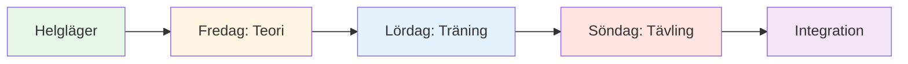
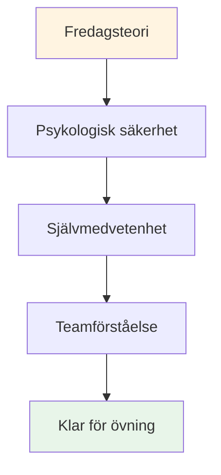

# Träningsläger: Helg med mentalt spelintensivt

## Översikt

Ett omfattande helgläger (fredag-söndag) för 10-20 spelare som kombinerar mental spelteori, träning i pisten och tävlingsinriktad tillämpning. Detta intensiva format skapar transformerande lärande genom integration av alla tre elementen.

::: tip Två avsnitt i den här guiden
- **[För deltagare](#för-deltagare)** - Vad spelarna kommer att uppleva under helgen
- **[För arrangörer](#för-arrangörer)** - Hur man planerar och genomför träningslägret
:::

::: tip Träningslägrets filosofi
**Teori utan praktik är bara information. Övning utan teori är bara repetition. Tävling utan reflektion är bara lek.** Den här helgen integrerar alla tre för transformerande lärande.
:::

## Snabbåtkomst

| Avsnitt | Ändamål | Tillträde |
|---------|---------|--------|
| **För deltagare** | Helgschema och vad man ska ta med sig | [Visa avsnitt](#för-deltagare) |
| **För arrangörer** | Komplett planerings- och faciliteringsguide | [Visa avsnitt](#för-arrangörer) |
| **Dagliga scheman** | Detaljerad tidsplan och aktiviteter | [Fredag](#fredag-kväll-mental-spel-grund-3-4-timmar) • [Lördag](#lördag-träning-ansökan-heldag) • [Söndag](#söndag-tävling-integration-heldag) |
| **Relaterade guider** | Andra träningsformat | [Mental resa](/sv/guider/mental-resa/) • [Workshop](/sv/guider/workshop/) |

---

## För deltagare

### Vad man kan förvänta sig

Det här är en intensiv helg som kommer att utmana dig mentalt, fysiskt och emotionellt. Du kommer att lära dig mentala spelkoncept, öva på dem i pisten och tillämpa dem i tävling – samtidigt som du bygger djupa band med medspelare.

**Helgens struktur:**

### Daglig uppdelning

#### Fredag kväll: Grundläggande mental lek (3-4 timmar)
**Vad:** Teoripass om mentala spelkoncept
**Var:** Mötesrum inomhus
**Format:** Cirkeldiskussion och övningar

**Du kommer att lära dig:**
- Zon- och flödestillstånden
- Inre kritiker vs. inre coach
- Tryckresponsmönster
- Grunderna i rutinen före sprutan

**Aktiviteter:**
- Incheckning och grundregler
- Bouleis isberg
- Skapande av användarmanual
- Övning om rädsla i en hatt

#### Lördag: Övning och tillämpning (heldag)
**Morgon (3 timmar):** Strukturerad träning med mentalt fokus
**Eftermiddag (3 timmar):** Trycksimuleringsövningar
**Kväll (2 timmar):** Reflektion och integration

**Du kommer att öva:**
- Förskottsrutiner i riktiga kast
- Återställ tekniker efter misstag
- Fokusankare under tryck
- Protokoll för teamkommunikation

**Formatera:**
- Övningar i små grupper (3-4 spelare)
- Videoanalys av mentala mönster
- Tryckscenarier
- Kvällsavrapportering

#### Söndag: Tävling och integration (heldag)
**Morgon (3 timmar):** Turneringsspel
**Eftermiddag (2 timmar):** Finalrundorna
**Kväll (1 timme):** Avslutande reflektion

**Du kommer att ansöka:**
- Alla mentala verktyg i tävling
- Teamprotokoll under press
- Återställning av fel i realtid
- Reflektionsprocess efter matchen

### Vad man ska ta med sig

**Nödvändig:**
- Dina boulebanor och din utrustning
- Bekväma kläder för alla väder
- Anteckningsbok och penna
- Öppet sinne och vilja att dela med sig
- Vattenflaska

**Frivillig:**
- Träningsdagbok
- Frågor om specifika psykiska utmaningar
- Exempel på pressade situationer du står inför

**Behövs inte:**
- Tekniska coachningsförfrågningar (detta är mentalt spelfokuserat)
- Ego eller behov av att bevisa sig själv
- Andras bedömning

### Grundregler för helgen

::: tip Behållaren
Alla deltagare är överens om att:
1. **Sekretess** - Det som delas stannar här
2. **Respektera** - Hedra andras sårbarhet
3. **Deltagande** - Engagera dig fullt ut i alla aktiviteter
4. **Tillväxttänkande** - Omfamna obehag som lärande
5. **Stöd** - Hjälp lagkamrater att tillämpa koncept
:::

### Vad du lämnar med dig

**Kunskap:**
- Djup förståelse för dina mentala mönster
- Praktiska verktyg för tryckhantering
- Lagprotokoll för tävling
- Personlig förbehandlingsrutin

**Färdigheter:**
- Möjlighet att komma åt flödestillstånd
- Tekniker för att återställa misstag
- Inre coachens omformulering
- Fokusankare

**Förbindelse:**
- Djupare band med lagkamraterna
- Delat språk för mentalt spel
- Stödnätverk för fortsatt tillväxt

**Material:**
- Färdigställda arbetsblad och övningar
- Videoanalys av dina mentala mönster
- Handlingsplan för de kommande 30 dagarna
- Tillgång till alla utbildningsmoduler

### Typiskt schema

**Fredag:**
- 18:00 - Ankomst och incheckning
- 19:00 - Middag
- 20:00 - Öppningssession (teori)
- 23:00 - Fritid / vila

**Lördag:**
- 08:00 - Frukost
- 09:00 - Morgonträning
- 12:00 - Lunch
- 13:30 - Eftermiddagsträning
- 17:00 - Paus
- 18:00 - Middag
- 19:30 - Kvällsreflektionssession
- 21:00 - Fritid / vila

**Söndag:**
- 08:00 - Frukost
- 09:00 - Turneringen börjar
- 12:00 - Lunch
- 13:00 - Finalomgångar
- 15:00 - Utmärkelser och erkännanden
- 16:00 - Avslutningscirkeln
- 17:00 - Avgång

---

## För arrangörer

### Planeringsöversikt

Den här sektionen innehåller allt du behöver för att organisera och genomföra ett lyckat helgläger för 10–20 spelare.

### Planering före lägret (6-8 veckor i förväg)

### Gruppstorlek och struktur

**Optimalt:** 10–20 spelare
- **Lite läger (10-12):** Mer intimt, djupare delning
- **Stort läger (16-20):** Mer mångsidiga perspektiv, kräver undergrupper

**Lagstruktur:**
- Dela upp er i lag om 3-4 personer för träning och tävling
- Blanda skicklighetsnivåer och spelstilar
- Rotera lagen under helgen

### Personalkrav

| Roll | Ansvar | Kvantitet |
|------|------------------|----------|
| **Koordinator för mental prestation** | Leda teoripass, gruppdynamik | 1 |
| **Teknisk tränare** | Övervaka övningen, ge feedback | 1-2 |
| **Tävlingsledare** | Anordna turnering, hantera logistiken | 1 |
| **Stödpersonal** | Måltider, upplägg, administration | 1-2 |

### Platskrav

::: info Anläggningsbehov
**Pist:**
- Flera terränger (minst 3-4 pister)
- Olika underlag om möjligt (grus, sand, hårda)
- Belysning för kvällslek

**Inomhusutrymme:**
- Plats för 20 personer i cirkel (teoripass)
- Separat från pisten
- Whiteboard/projektor
- Bekväma sittplatser

**Logi:**
- På plats eller i närheten (gångavstånd)
- Delade rum uppmuntrar till sammanhållning
- Tyst plats för reflektion

**Catering:**
- Näringsfokuserade måltider (se [Matguide](./food))
- Undvik sockerkrascher
- Vätskestationer
:::

### Materialchecklista

::: details Komplett materiallista
**Teoripass:**
- [ ] Stolar för cirkeln (inga bord)
- [ ] Boule och cochonett för center
- [ ] Flipcharts och markörer
- [ ] Fästisar
- [ ] Arbetsblad (användarmanual, inre kritiker, etc.)
- [ ] Papper och pennor
- [ ] Projektor (för webbplatsinnehåll)

**Övningspass:**
- [ ] Måttband
- [ ] Koner/markörer för borrar
- [ ] Videokamera/stativ
- [ ] Urklipp och papper (spårning)
- [ ] Vissla

**Konkurrens:**
- [ ] Poänglistor
- [ ] Turneringsställning
- [ ] Priser/erkännande
- [ ] Första hjälpen-kit

**Logistik:**
- [ ] Namnetiketter
- [ ] Deltagarlista med kontakter
- [ ] Kontaktinformation för nödsituationer
- [ ] Vattenflaskor
- [ ] Solskyddsmedel
- [ ] Vävnadspapper (för känslomässigt arbete!)
:::

## Helgschema

### Fredag kväll (3 timmar)

**18:00-18:30 - Ankomst och välkomst**
- Incheckning
- Rumstilldelningar
- Översikt över helgen

**18:30-19:30 - Middag**
- Näringsfokuserad måltid
- Informella introduktioner

**19:30-22:30 - Teoripass: Grunderna**

Använd [Workshopguiden](./workshop) för detaljerad handledning:

1. **Grundregler (15 min)** - Skapa psykologisk trygghet
2. **Incheckningsmatris (20 min)** - Bedöm gruppens energi
3. **Isberget (30 min)** - Utforska inre tankar
4. **Användarmanual (45 min)** - Bygg upp teamförståelse
5. **Rädsla i en hatt (45 min)** - Bryt isoleringen
6. **Utcheckning (15 min)** - Slut på slingan

**22:30 - Fritid**
- Informellt umgänge
- Vila och reflektion

### Lördag (Heldag - Teori + Praktik)

**08:00-09:00 - Frukost och mindfulness**
- Tyst frukost
- Valfri 15-minuters guidad meditation
- Sätt upp avsikter för dagen

**09:00-10:30 - Teoripass: Att koppla innehåll till upplevelse**

Välj 3-4 ämnen från Akademins webbplats och utforska det inre spelet:

**Exempelämnen:**

1. **[Näring](./utbildning/näring/)** (20 min)
   - &quot;Hur förändras ditt matval under press?&quot;
   - &quot;Äter du vad din kropp behöver eller vad din ångest vill ha?&quot;
   - Övning: Planera kost inför tävlingsdagen

2. **[Mental styrka](./utbildning/mentalt-spel/mental-styrka/)** (25 min)
   - &quot;Hur är din relation till misslyckande?&quot;
   - &quot;Hur pratar man med sig själv efter en miss?&quot;
   - Aktivitet: Omformulera inre kritiker till inre coach

3. **[Mindfulness](./utbildning/mentalt-spel/mindfulness/)** (25 min)
   - &quot;Vart tar dina tankar vägen under pausen innan du kastar?&quot;
   - &quot;Vad drar dig ur nuet?&quot;
   - Övning: 5-minuters kroppsskanning

4. **[Taktik](./utbildning/teknik/taktik/)** (20 min)
   - &quot;Beras ditt val av skott på strategi eller rädsla?&quot;
   - &quot;När spelar man säkert kontra att ta risker?&quot;
   - Diskutera: Riskprofiler i gruppen

**10:30-10:45 - Paus**

**10:45-12:30 - Integration i pisten: Övningar med mentalt fokus**

**Övning 1: Välj din chans (30 min)**

Från [Workshopguiden](./workshop) - öva på att äga avsikt och tvivla:

1. Tillkännage målet: &quot;Jag skjuter med järnet&quot;
2. Statens förtroende: &quot;Jag får 7 av 10&quot;
3. Namnge den inre tanken: &quot;Min inre röst oroar sig för bakåtspinn&quot;
4. Utför skottet
5. Reflektera: &quot;Vad hände? Vad lärde du dig?&quot;

**Övning 2: Kognitiv interferens (30 min)**

Testa om tekniken har blivit automatisk:
- Koordinatorn ställer komplexa frågor medan spelaren skjuter
- &quot;Nämn 5 huvudstäder&quot; eller &quot;Räkna baklänges från 100 gånger 7&quot;
- Framgång = teknik är implicit, inte medvetet bearbetad

**Övning 3: Övning i användarmanual (30 min)**

Använd användarmanualerna från och med fredag:
- Spela i lag om 3
- Efter varje skott svarar lagkamraterna enligt användarmanualen.
- &quot;Marc behöver tystnad efter en miss&quot; – laget hyllar det
- Sammanfattning: &quot;Hur kändes det att bli förstådd?&quot;

**12:30-14:00 - Lunch och vila**
- Näringsfokuserad måltid
- Tyst tid för reflektion
- Valfritt: Individuella incheckningar med koordinator

**14:00-17:00 - Träningspass: Terränganpassning**

**Mål:** Bygga anpassningsförmåga och mental flexibilitet

**Inställning:**
- Rotera genom 3-4 olika terränger/pister
- 45 minuter per terräng
- Fokusera på mental anpassning, inte bara teknisk

**Rotationsstruktur:**

| Terräng | Mentalt fokus | Öva |
|---------|--------------|----------|
| **Terräng 1: Mjuk/Sand** | Acceptans av osäkerhet | &quot;Donnéen - acceptera det som är&quot; |
| **Terräng 2: Hård/Grusig** | Precision under press | &quot;Lita på din teknik&quot; |
| **Terräng 3: Ojämn** | Emotionell reglering | &quot;Var lugn när det är orättvist&quot; |
| **Terräng 4: Tävling** | Åtkomst till flödesstatus | &quot;Hitta zonen&quot; |

**Underlättande:**
- Teknisk coach ger feedback på tekniken
- MPC frågar: &quot;Vad händer i ditt sinne just nu?&quot;
- Spelarjournal mellan rotationer

**17:00-18:00 - Paus och reflektion**
- Individuell journalföring
- &quot;Vad lärde du dig om dig själv idag?&quot;
- &quot;Vad är en sak du kommer att göra annorlunda imorgon?&quot;

**18:00-19:00 - Middag**

**19:00-21:00 - Kvällsteori: Djup sårbarhet**

**Aktivitet 1: Att omformulera den inre kritikern (45 min)**

Se [Workshopguide](./workshop) för fullständigt protokoll:
1. Identifiera den exakta kritikerfrasen
2. Omformulera som inre coach
3. Partnerpraktik

**Aktivitet 2: Tävlingsförberedelser (45 min)**

Imorgon är det tävlingsdag. Förbered dig mentalt:

1. **Visualisering (15 min)**
   - Slut ögonen
   - Tänk dig ett perfekt skott
   - Känn självförtroendet
   - Lägg märke till lugnet

2. **Teamprotokoll (20 min)**
   - Skapa signaler för stöd
   - &quot;Jag behöver en återställning&quot; = röra boules
   - &quot;Jag behöver uppmuntran&quot; = knytnäve
   - &quot;Jag behöver utrymme&quot; = ta ett steg tillbaka

3. **Sätt upp avsikter (10 min)**
   - &quot;Imorgon ska jag fokusera på...&quot;
   - &quot;Mitt mål är inte att vinna, utan att...&quot;
   - &quot;Jag ska öva...&quot;

**Utcheckning (30 min)**
- Dela en rädsla om morgondagen
- Dela en avsikt
- Gruppstöd

**21:00 - Fritid**
- Tidigt i säng (tävling imorgon!)
- Tyst reflektion

### Söndag (tävlingsdag)

**08:00-09:00 - Frukost och mental förberedelse**
- Lätt frukost (se [Näringsguide](./education/nutrition/))
- 15 minuters mindfulnessövning
- Teammöten

**09:00-09:30 - Tävlingsbriefing**

**Format:** Round-robin-turnering
- Lag om 3
- Spela till 13 poäng
- Alla spelar alla
- Fokusera på PROCESS, inte resultat

**Twisten: Poängsättning av mental prestation**

::: tip Dubbelt poängsystem
**Traditionell:** Vunna poäng
**Mental prestation:** Poängsatt av MPC

Mentala prestationspoäng (0-5 per match):
- Begagnade verktyg i användarmanualen
- Stöttade effektivt lagkamrater
- Hanterad inre kritiker
- Förblev närvarande (inte uppehållande vid tidigare bilder)
- Bevisad psykologisk säkerhet

**Vinnare:** Bästa kombinerade poäng (traditionell + mental)
:::

**09:30-13:00 - Morgontävling**
- Round-robin-spel
- MPC observerar och poängsätter
- Teknisk tränare ger kort feedback mellan matcherna
- Vätskeintag och mellanmålspauser

**13:00-14:00 - Lunch**
- Näringsfokuserad
- Informell reflektion
- Vila

**14:00-17:00 - Eftermiddagstävling**
- Fortsätt round-robin
- Semifinaler och finaler
- Ökande tryck
- Tillämpa morgonens lärdomar

**17:00-17:30 - Utmärkelser och erkännanden**

**Kategorier:**
- Traditionell vinnare
- Vinnare av mental prestation
- Mest förbättrade
- Bästa lagkamrat
- Modpris (mest sårbara)

**17:30-19:00 - Slutreflektion**

**Kritisk:** Det är här lärandet cementeras.

**Strukturera:**

**1. Individuell reflektion (15 min)**
Skriv i dagboken:
- Vad lärde du dig om dig själv i helgen?
- Vad överraskade dig?
- Vad kommer du att göra annorlunda?
- Vad tar du med dig hem?

**2. Delning i liten grupp (30 min)**
Grupper om 4-5:
- Dela viktiga insikter
- Vad resonerade mest?
- Vad var svårast?
- Vad var mest värdefullt?

**3. Fullständig gruppintegration (30 min)**
Ringa upp:
- Varje person delar EN viktig lärdom
- MPC validerar och kopplar samman teman
- Diskutera: &quot;Hur kommer ni att tillämpa detta?&quot;

**4. Åtaganden (15 min)**
- Varje person åtar sig ett åtagande
- &quot;I min nästa tävling ska jag...&quot;
- Gruppvittnen och stöd

**5. Avslutning (15 min)**
- Tacka deltagarna för modet
- Påminn om sekretessen
- Utbyt kontakter
- Planuppföljning (valfritt online-möte)

**19:00 - Middag och avresa**

## Tips för facilitering

### Balansering av teori och praktik

::: warning Överbelasta inte teorin
**Misstaget:** För mycket prat, för lite handling

**Saldo:**
- Teori skapar medvetenhet
- Övning bygger färdighet
- Integrering av tävlingstester
- Reflektion cementerar lärandet

**Tumregel:** 30 % teori, 40 % praktik, 20 % tävling, 10 % reflektion
:::

### Hantera gruppdynamik

**Tävlingsalfa:**
- Vill vinna till varje pris
- Motstår sårbarhet
- **Strategi:** Kanalisera tävlingsinriktningen till mental prestationsbedömning

**Den tysta observatören:**
- Tar in allt, delar inte
- **Strategi:** Skapa ingångspunkter med låg risk, validera observation som deltagande

**Skeptikern:**
- &quot;Det här känsliga materialet fungerar inte&quot;
- **Strategi:** Verbal Aikido - rikta in dig och vrid (se [Workshopguide](./workshop))

**Den som delar för mycket:**
- Dominerar diskussionen
- **Strategi:** &quot;Tack, vi hör av oss till andra&quot;

### Hantera känslomässiga stunder

**Någon gråter under Rädsla i hatten:**
- ✅ Normalisera: &quot;Tårar är mod, inte svaghet&quot;
- ✅ Erbjud näsdukar, ha inte bråttom
- ✅ Fråga: &quot;Vad behöver du just nu?&quot;
- ❌ Gör inte: &quot;Det är okej, gråt inte&quot;

**Konflikt mellan spelare:**
- ✅ Pausa och adressera
- ✅ &quot;Vad händer just nu?&quot;
- ✅ Använd som lärandeögonblick
- ❌ Gör inte: Ignorera eller minimera

**Någon stänger av:**
- ✅ Checka in privat under rasten
- ✅ &quot;Jag märkte att du blev tyst. Vad är det som händer?&quot;
- ✅ Erbjud alternativ: delta annorlunda, ta en paus
- ❌ Gör inte: Ropa ut offentligt

## Uppföljning efter lägret

### Omedelbart (24–48 timmar)

**Skicka till alla deltagare:**
- Tackmeddelande
- Sammanfattning av viktiga slutsatser
- Bilder från helgen
- Kontaktlista (med tillstånd)
- Länk till resurser på webbplatsen

**Individuella incheckningar:**
- Sms:a alla som delat mycket
- &quot;Hur känner du dig inför helgen?&quot;
- Åtgärda eventuella sårbarhetsproblem

### Kortsiktigt (2 veckor)

**Valfri online-session (60-90 min):**
- Hur har du tillämpat lärdomarna?
- Vad fungerar? Vad är utmanande?
- Kamratstöd och problemlösning
- Förstärk åtagandena

### Långsiktig (1–3 månader)

**Deltagare i undersökningen:**
- Vad är annorlunda i ditt spel?
- Vilka verktyg använder du fortfarande?
- Vad skulle göra nästa läger bättre?
- Skulle du rekommendera till andra?

**Påverkan på banan:**
- Tävlingsresultat
- Självrapporterat självförtroende
- Teamdynamik
- Fortsatt engagemang

## Anpassning för olika gruppstorlekar

### Litet läger (10-12 spelare)

**Fördelar:**
- Djupare delning
- Mer individuell uppmärksamhet
- Starkare band

**Justeringar:**
- En grupp för all teori
- Mer tid per person i aktiviteter
- Intimt tävlingsformat

### Stort läger (16-20 spelare)

**Fördelar:**
- Olika perspektiv
- Mer variation i tävlingar
- Stordriftsfördelar

**Justeringar:**
- Delas in i två grupper för några teoripass
- Behöver 2 MPC/handledare
- Större turneringsram
- Mer strukturerade rotationer

## Budgetöverväganden

### Inkomst

| Punkt | Pris per person | 20 personer | 10 personer |
|------|------------------|-----------|-----------|
| **Registrering** | 150–250 euro | 3 000–5 000 euro | 1 500–2 500 euro |

### Utgifter

| Kategori | Kosta | Anteckningar |
|----------|------|-------|
| **Uthyrning av lokaler** | 500–1 000 euro | Helgpris |
| **Logi** | 40–60 €/person/natt | Delade rum |
| **Måltider** | 30–40 euro/person/dag | 6 måltider |
| **Personal** | 500–1 000 euro | MPC + tränare |
| **Material** | 100–200 euro | Arbetsblad, förnödenheter |
| **Priser** | 100–200 euro | Erkännandeobjekt |

**Totalt per person:** 120–180 €
**Marginal:** 30–70 euro/person (eller nollpunkt för samhällsbyggande)

## Framgångsmått

### Omedelbara indikatorer

- [ ] Psykologisk säkerhetspoäng (1–10 i genomsnitt &gt;7)
- [ ] Deltagandegrad (&gt;80 % delande aktivt)
- [ ] Färdigställandegrad (&gt;90 % stannar hela helgen)
- [ ] Nöjdhetspoäng (1–10 i genomsnitt &gt;8)

### Långsiktiga indikatorer

- [ ] Beteendeförändring (med hjälp av verktyg i tävling)
- [ ] Prestationsförbättring (självrapporterad)
- [ ] Gemenskapsbyggande (hålla kontakten)
- [ ] Referenser (rekommendationer till andra)

## Vanliga misstag att undvika

::: danger Fallgropar
**1. För mycket innehåll**
- Försöker täcka allt
- **Åtgärd:** Fokusera på djup, inte bredd

**2. Hoppa över reflektion**
- Rusar till nästa aktivitet
- **Åtgärd:** Bygg in bearbetningstid

**3. Ignorerar motstånd**
- Att övervinna skepticism
- **Åtgärd:** Ta itu med det direkt med verbal aikido

**4. Teknisk coachning under teorin**
- Blanda roller
- **Åtgärd:** Tydliga gränser mellan MPC och teknisk tränare

**5. Ingen uppföljning**
- Helgen är slut, lärandet slutar
- **Åtgärd:** Planera kontaktpunkter efter lägret
:::

## Resurser

### Från denna webbplats

- [Workshopguide](./workshop) - Detaljerade protokoll för handledning
- [Guide för träningssession](./training-session) - För kontinuerlig övning
- [Näring](./utbildning/näring/) - Protokoll för tävlingsdagen
- [Mental styrka](./utbildning/mentalt-spel/mental-styrka/) - Inre spelbegrepp
- [Mindfulness](./utbildning/mentalt-spel/mindfulness/) - Närvarotekniker
- [Taktik](./utbildning/teknik/taktik/) - Strategiskt tänkande

### Rekommenderad läsning

- *Tennisens inre spel* av Timothy Gallwey
- *Tankesätt* av Carol Dweck
- *Den orädda organisationen* av Amy Edmondson

