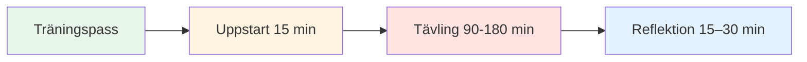

# Träningspass: Tävlingsövningsguide


## Hur fyra spelare kan träna tillsammans regelbundet

Den här guiden visar hur man skapar en regelbunden träningsgrupp på fyra spelare som tävlar mot varandra på olika underlag och i olika miljöer i 2–4 timmar. Efterlikna verklig konkurrens samtidigt som man bygger upp psykologisk trygghet och mentala prestationsförmåga.

::: tip Utbildningssessionens filosofi
**Tävling utan reflektion är bara lek. Träning utan tävling är bara övning.** Detta format kombinerar båda: tävla hårt och reflektera sedan djupt.
:::

## Snabbåtkomst

| Avsnitt | Ändamål | Tillträde |
|---------|---------|--------|
| **Hitta din grupp** | Hur man rekryterar rätt 4 spelare | [Visa avsnitt](#hitta-din-grupp) |
| **Sessionsstruktur** | 2-timmars- och 4-timmarsformat | [Visa avsnitt](#sessionsstruktur) |
| **Startprotokoll** | Hur man börjar varje session | [Visa avsnitt](#startup-protocol-15-min) |
| **Reflektionsguide** | Avrapporteringsprocess efter sessionen | [Visa avsnitt](#reflektionsprotokoll-15-30-min) |
| **Relaterade guider** | Andra träningsformat | [Mental resa](/sv/guider/mental-resa/) • [Workshop](/sv/guider/workshop/) • [Träningsläger](/sv/guider/träningsläger/) |



## Varför 4 spelare?

**Det perfekta numret:**
- **2v2-format** - Speglar riktig konkurrens
- **Rotationsalternativ** - Byt partner, spela singel
- **Kamratlig inlärning** - Olika spelstilar
- **Ansvar** - Svårt att avboka på 3 personer
- **Intimitet** - Liten nog för djup delning

::: info Gruppdynamiken
4 spelare skapar den perfekta balansen mellan tävlingsintensitet och psykologisk trygghet. Ni tävlar hårt, men ni stödjer också varandras utveckling.
:::

## Hitta din grupp

### Ideal gruppsammansättning

**Färdighetsnivå:**
- Liknande nivå (inom 1-2 nivåer)
- Alla engagerade i förbättring
- Blandning av pointers och skyttar
- Olika spelstilar

**Tankesätt:**
- Öppen för sårbarhet
- Villig att reflektera
- Tävlingsinriktad men stödjande
- Tillväxtorienterad

**Logistik:**
- Bor inom 30 minuter från varandra
- Kan binda sig till ett vanligt schema
- Liknande tillgänglighet

### Rekrytering av din grupp

**Var man hittar spelare:**
- Din klubbs elitspelare
- Regionala turneringsstamgäster
- Boule-communities online
- Fråga din tränare om rekommendationer

**Inbjudan:**
> &quot;Jag håller på att bilda en liten träningsgrupp på fyra spelare som vill tävla regelbundet och jobba på det mentala spelet. Vi skulle träffas varje vecka i 2–3 timmar, spela hårt och sedan reflektera över vad vi lär oss. Är du intresserad?&quot;

## Sessionsstruktur

### 2-timmars session

| Tid | Aktivitet | Varaktighet |
|------|----------|----------|
| **Uppstart** | Incheckning och installation | 15 minuter |
| **Konkurrens** | 2v2-matcher | 90 minuter |
| **Reflexion** | Avrapportering och lärande | 15 minuter |

### 3-timmarssession

| Tid | Aktivitet | Varaktighet |
|------|----------|----------|
| **Uppstart** | Incheckning och installation | 15 minuter |
| **Tävlingsrunda 1** | 2v2-matcher | 60 minuter |
| **Bryta** | Vila och informellt samtal | 15 minuter |
| **Tävlingsrunda 2** | Rotera partners | 60 minuter |
| **Reflexion** | Djupgående debriefing | 30 minuter |

### 4-timmars session

| Tid | Aktivitet | Varaktighet |
|------|----------|----------|
| **Uppstart** | Incheckning och installation | 20 minuter |
| **Tävlingsrunda 1** | 2v2-matcher | 75 minuter |
| **Bryta** | Vila och mellanmål | 15 minuter |
| **Tävlingsrunda 2** | Rotera partners | 75 minuter |
| **Bryta** | Vila | 10 minuter |
| **Tävlingsrunda 3** | Singlar eller utmaning | 45 minuter |
| **Reflexion** | Djupgående debriefing och planering | 30 minuter |


## Startprotokoll (15–20 minuter)

### 1. Fysisk uppställning (5 min)

**Välj terräng:**
- Rotera genom olika ytor varje vecka
- Variera svårighetsgrad och förhållanden
- Ibland väljer man avsiktligt obekväm terräng

**Ställ in utrymmet:**
- Markera gränser tydligt
- Förbered mätverktyg
- Vattenstation
- Skugga vid behov

### 2. Mental incheckning (10 min)

**Incheckningscirkeln:**

Stå i en cirkel (inga boulespel ännu) och gå runt:

**Varje person delar:**
1. **Energinivå** (1-10): &quot;Jag är på en 7:a idag&quot;
2. **Mentalt tillstånd**: &quot;Jag känner mig fokuserad&quot; eller &quot;Jag är distraherad av arbetsstress&quot;
3. **Avsikt**: &quot;Idag vill jag jobba på att hålla mig lugn efter missar&quot;

**Varför detta är viktigt:**
- Bygger medvetenhet om mentalt tillstånd
- Skapar empati i gruppen
- Sätter individuellt fokus för sessionen
- Normaliserar att vara &quot;avstängd&quot; vissa dagar

**Tips för handledaren:** Rotera vem som går först varje vecka

### 3. Påminnelse om grundregler (5 min)

**Påminn kort varje session:**

::: tip Grundregler för sessionen
1. **Tävla hårt** - Spela för att vinna, utan att tveka
2. **Stödja tillväxt** - Hjälp varandra att lära sig
3. **Respektera användarmanualer** - Hedra hur varje person vill bli behandlad
4. **Var närvarande** - Inga telefoner under spel
5. **Reflektera ärligt** - Dela vad som verkligen händer inombords
6. **Sekretess** - Det som delas här stannar här
:::

**Balansen:**
> &quot;Vi tävlar som om det vore en turnering, men vi stöttar som om vi vore lagkamrater. Hårda mot spelet, mjuka mot personen.&quot;

## Tävlingsregler

### Matchformat

**Standard 2v2:**
- Spela till 13 poäng
- Standardregler för boule
- Håll poängen ärligt
- Mät vid behov (gissa inte)

**Rotationsalternativ:**

**Vecka 1:** A+B vs C+D
**Vecka 2:** A+C vs B+D
**Vecka 3:** A+D vs B+C
**Vecka 4:** Singel round robin

### Skapa konkurrensmiljö

::: warning Kritiskt: Gör det verkligt
**Detta är inte tillfällig träning.** Behandla det som en turnering:

✅ **Gör:**
- Behåll officiell poängställning
- Mät noggrant
- Kalla fotfel
- Ta det på allvar
- Fira bra bilder
- Visa besvikelse över missar

❌ **Gör inte:**
- Ge &quot;omarbetningar&quot;
- Var alltför avslappnad
- Låt dåliga samtal glida
- Skämta genom hela spelet
- Kom med ursäkter
:::

### Den mentala prestationsvridningen

**Spåra två poäng:**

1. **Traditionellt resultat** - Vunna poäng
2. **Mental prestationspoäng** - Hur väl du hanterade ditt inre spel

**Kriterier för mental prestation (självpoäng 1–5 efter varje match):**

| Kriterium | 1 (Dålig) | 3 (Bra) | 5 (Utmärkt) |
|-----------|----------|----------|---------------|
| **Har varit närvarande** | Uppehöll sig vid tidigare bilder | Mestadels närvarande | Helt i nuet |
| **Hanterad inre kritiker** | Hårt självprat | Fångad och omformulerad | Begagnad inre tränare |
| **Emotionell reglering** | Synlig frustration | Höll sig mestadels lugn | Lugn rakt igenom |
| **Stödd partner** | Ignorerad eller klandrad | Grundläggande stöd | Begagnad användarmanual |
| **Fokus** | Distraherad, ofokuserad | Mestadels fokuserad | Laserfokuserad |

**Totalt:** /25 per match

**Varför detta är viktigt:**
- Flyttar fokus från resultat till process
- Bygger medvetenhet om mentalt spel
- Skapar ansvarsskyldighet för inre arbete
- Hyllar mental prestation, inte bara seger

### Variera miljön

**Rotera genom olika utmaningar:**

**Vecka 1: Hemmaterräng**
- Din vanliga pist
- Bekväma förhållanden
- Fokus: Bygga självförtroende

**Vecka 2: Svår terräng**
- Ojämn, utmanande yta
- Fokus: Emotionell reglering, acceptans

**Vecka 3: Annan plats**
- En annan klubbs pist
- Fokus: Anpassningsförmåga

**Vecka 4: Tryckförhållanden**
- Åskådare (bjud in andra att titta)
- Fokus: Hantering av externt tryck

**Vecka 5: Väderutmaning**
- Vind, värme eller kyla
- Fokus: Mental styrka

**Vecka 6: Tidspress**
- Skottklocka (30 sekunder per kast)
- Fokus: Beslutsfattande under press

```mermaid
graph TD
    A[Variera miljön] --> B[Olika ytor]
    A --> C[Olika platser]
    A --> D[Olika villkor]
    A --> E[Olika tryck]

    B --> F[Bygg anpassningsförmåga]
    C --> F
    D --> F
    E --> F

    style A fill:#e8f5e9
    style F fill:#fff4e1


## Reflection Protocol (15-30 minutes)

**Critical:** This is where the learning happens. Don't skip it!

### Short Reflection (15 min)

**After each game, quick debrief:**

**Go around the circle, each person shares:**

1. **Mental Performance Score** (1-5): "I give myself a 4 today"
2. **One thing that went well mentally**: "I stayed calm after my miss in the 3rd end"
3. **One thing to work on**: "I need to catch my inner critic faster"

**Group discussion:**
- "What did you notice about your inner game today?"
- "When did you feel most in the zone?"
- "When did you lose focus?"

### Deep Reflection (30 min)

**After final game, deeper debrief:**

**Structure:**

**1. Individual Journaling (5 min)**

Write privately:
- What happened in my mind during pressure moments?
- When did I use my Inner Coach vs. Inner Critic?
- How did I support my partner?
- What pattern am I noticing about myself?

**2. Pair Sharing (10 min)**

Partner up, share:
- One insight from journaling
- One question you're sitting with
- One commitment for next session

**3. Group Integration (15 min)**

Full circle:
- Each person shares ONE key learning
- Group identifies themes
- Discuss: "What are we learning as a group?"
- Set focus for next session

**Closing:**
- Thank each other for showing up
- Confirm next session date/time
- One-word check-out: "How are you leaving?"


## User Manual Integration

### Creating Your User Manuals

**In your first session together, each person completes:**

| Section | Prompt | Example |
|---------|--------|---------|
| **My Stress Signature** | "When I'm anxious, I..." | "...go completely quiet" |
| **How to Support Me** | "After a miss, I need..." | "...silence, not encouragement" |
| **My Trigger** | "I get defensive when..." | "...someone questions my shot choice" |
| **My Reset Signal** | "When I need a mental reset, I..." | "...touch my boules and take 3 breaths" |

**Share with the group and keep copies.**

### Using User Manuals During Play

**During competition:**
- Partner knows how to support you
- Teammates respect your needs
- No guessing about what helps

**Example:**
- Marc's User Manual says: "After a miss, I need 30 seconds of silence"
- His partner knows: Don't immediately encourage, give space
- Result: Marc feels understood, recovers faster

**This is psychological safety in action.**

## Advanced Variations

### The Mental Challenge Week

**Once a month, add a mental challenge:**

**Week 1: Silent Game**
- No talking during play
- Only non-verbal communication
- Focus: Internal awareness

**Week 2: Positive Self-Talk Only**
- Catch and reframe every negative thought
- Say Inner Coach phrase out loud
- Focus: Cognitive restructuring

**Week 3: Pressure Simulation**
- Play with spectators
- Announce score loudly
- Focus: External pressure management

**Week 4: Gratitude Game**
- After each end, state one thing you're grateful for
- Focus: Positive mindset

### The Vulnerability Round

**Every 4-6 weeks, dedicate a session to deeper sharing:**

**Format:**
- 30 min: Play one game
- 60 min: Deep reflection using [Workshop](./workshop) activities
- 30 min: Play final game applying insights

**Activities to use:**
- Fear in a Hat
- Reframing Inner Critic
- The Iceberg
- User Manual updates

**Why this matters:**
- Prevents the group from becoming just "playing buddies"
- Maintains psychological safety
- Deepens learning
- Builds authentic connection

## Tracking Progress

### Individual Tracking

**Keep a training journal:**

After each session, record:
- Date, location, conditions
- Partners and opponents
- Traditional score
- Mental performance score (1-5)
- Key insights
- Patterns noticed
- Commitments for next time

**Monthly review:**
- What's improving?
- What patterns keep showing up?
- What's my mental performance trend?
- What do I need to focus on?

### Group Tracking

**Shared document (Google Sheet):**

| Date | Location | Teams | Score | Mental Perf | Key Learning |
|------|----------|-------|-------|-------------|--------------|
| Jan 7 | Club A | A+B vs C+D | 13-11 | 4.2 avg | Staying calm in wind |
| Jan 14 | Club B | A+C vs B+D | 13-8 | 3.8 avg | Managing inner critic |

**Benefits:**
- See progress over time
- Notice group patterns
- Celebrate improvements
- Identify focus areas

## Sustaining the Group

### Commitment Agreement

**At the start, agree on:**

**Frequency:**
- Weekly? Bi-weekly? Monthly?
- Same day/time each week?
- How many sessions committed to? (suggest minimum 8-12)

**Cancellation Policy:**
- 24-hour notice required
- Maximum 2 cancellations per person per quarter
- If someone cancels repeatedly, have a conversation

**Rotation:**
- Who chooses location each week?
- Who facilitates reflection?
- How do we keep it fresh?

### Handling Conflicts

**When tension arises:**

::: warning Address It, Don't Avoid It
**The mistake:** Letting resentment build

**The solution:** Use it as a learning moment

**Script:**
> "I notice some tension. Can we pause and talk about what's happening? This is exactly the kind of moment we can learn from."
:::

**Common conflicts:**
- Disagreement on calls
- Perceived unfairness
- Personality clashes
- Competitive intensity

**Resolution process:**
1. Pause the game
2. Each person shares their perspective
3. Group validates both sides
4. Agree on how to move forward
5. Return to play

**This builds psychological safety.**

### Keeping It Fresh

**Avoid stagnation:**

**Every 8-12 weeks, change something:**
- Invite a 5th player for variety
- Play at a tournament together
- Do a mini training camp (full day)
- Bring in a guest coach
- Try a new format (singles, different scoring)
- Do a deep vulnerability session

**The goal:** Keep learning, keep growing, keep it interesting

## Integration with Tournaments

### Pre-Tournament Prep

**2 weeks before a major tournament:**

**Session focus:**
- Play on similar terrain
- Simulate tournament pressure
- Practice competition-day nutrition
- Rehearse pre-shot routines
- Visualize success

**Mental preparation:**
- What's your intention for the tournament?
- What's your Inner Coach phrase?
- What's your reset signal?
- How will you handle pressure?

### Post-Tournament Debrief

**After a tournament:**

**Dedicate a session to reflection:**

**Structure:**
- 30 min: Share tournament experience
- 30 min: What worked? What didn't?
- 30 min: What did you learn about yourself?
- 30 min: Play a game applying learnings

**Questions:**
- When did you feel most in the zone?
- When did you lose it?
- How did you handle pressure?
- What would you do differently?
- What are you proud of?

**This cements learning and builds resilience.**

## Resources & Tools

### From This Site

- [Workshop Guide](./workshop) - Deep facilitation protocols
- [Training Camp Guide](./training-camp) - Weekend intensive format
- [Nutrition](./education/nutrition/) - Competition-day protocols
- [Mental Strength](./education/mental-game/mental-strength/) - Inner game concepts
- [Mindfulness](./education/mental-game/mindfulness/) - Presence techniques
- [Tactics](./education/technique/tactics/) - Strategic thinking

### Recommended Tools

**Journaling:**
- Physical notebook or digital app
- Prompt: "What happened in my mind today?"

**Video Analysis:**
- Phone camera on tripod
- Review technique and body language
- Notice patterns

**Meditation Apps:**
- Headspace, Calm, Insight Timer
- 5-10 minutes before sessions

**Tracking:**
- Google Sheets for group data
- Personal spreadsheet for trends

## Success Stories

### Example: The Stockholm Four

**Group:** 4 elite players, ages 28-45
**Frequency:** Weekly, 3 hours
**Duration:** 18 months

**Results:**
- All 4 improved tournament rankings
- 2 made national team
- Mental performance scores increased from 3.2 to 4.5 average
- Group still meets 3 years later

**Key factors:**
- Consistent commitment
- Deep vulnerability work
- Honest reflection
- Mutual support

### Example: The Barcelona Crew

**Group:** 4 club players wanting to compete regionally
**Frequency:** Bi-weekly, 2 hours
**Duration:** 6 months

**Results:**
- Confidence increased dramatically
- All 4 entered first regional tournament
- 1 placed in top 8
- Group expanded to 8 players

**Key factors:**
- Started small and built trust
- Focused on mental game
- Celebrated small wins
- Kept it fun

## Common Challenges

### "We just end up playing, not reflecting"

**Solution:**
- Set a timer
- Designate a "reflection keeper"
- Make reflection non-negotiable
- Start with just 10 minutes

### "One person dominates"

**Solution:**
- Use structured sharing (everyone gets 2 minutes)
- Rotate who speaks first
- Gently redirect: "Let's hear from others"

### "It's getting stale"

**Solution:**
- Change locations
- Try new formats
- Do a vulnerability session
- Invite a guest
- Take a break and come back fresh

### "Someone's not committed"

**Solution:**
- Have an honest conversation
- Revisit commitment agreement
- Consider finding a replacement
- It's okay if someone leaves

## Getting Started Checklist

::: details Your First Session Checklist

**Before Session 1:**
- [ ] Find your 4 players
- [ ] Agree on frequency and duration
- [ ] Choose first location
- [ ] Share this guide with everyone
- [ ] Create group chat

**Session 1 Agenda:**
- [ ] Introductions and intentions
- [ ] Agree on ground rules
- [ ] Complete User Manuals
- [ ] Play first game
- [ ] Short reflection
- [ ] Schedule next 4 sessions

**Ongoing:**
- [ ] Rotate locations
- [ ] Track progress
- [ ] Deep reflection every 4-6 weeks
- [ ] Adjust format as needed
- [ ] Celebrate improvements
:::

## Final Thoughts

::: tip The Power of Regular Practice
**Consistency beats intensity.** Four players meeting regularly, competing hard, and reflecting deeply will improve faster than sporadic tournament play alone.

**Why?**
- Regular feedback loop
- Psychological safety to experiment
- Accountability and support
- Deliberate practice on mental game
- Community and connection

**The result:** You don't just get better at pétanque. You become a more complete competitor.
:::


