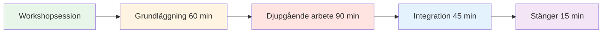
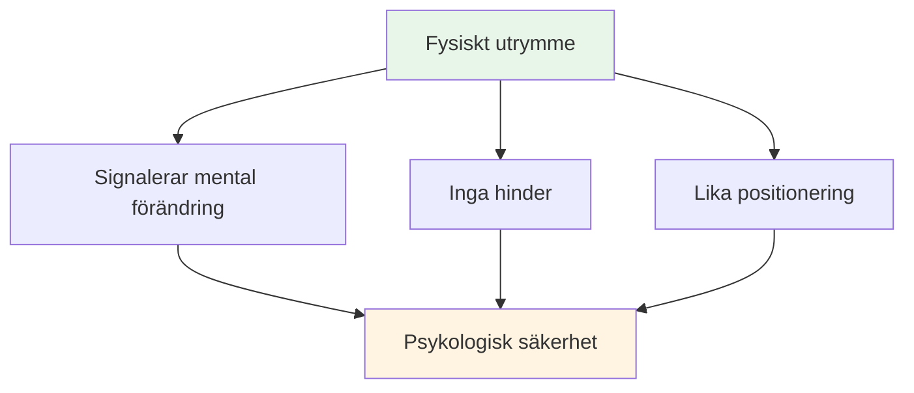
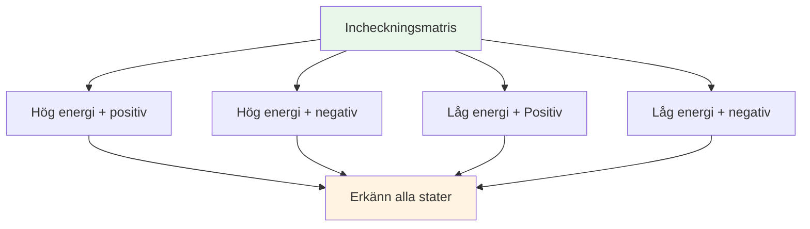
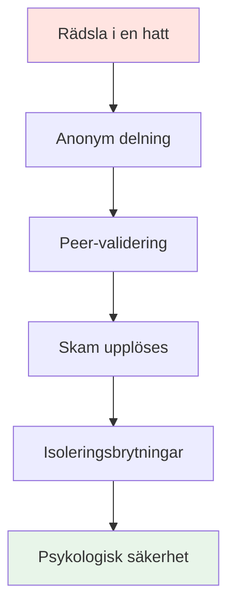

# Workshop: Avancerad mental spelsession (3-4 timmar)

## Översikt

Denna workshop är en avancerad teoretisk session på 3–4 timmar för 6–8 elitspelare, med fokus på djuppsykologiskt arbete och sårbarhetsbaserat lärande. Den går utöver grundläggande mentala färdigheter för att utforska det inre spelet på en djupgående nivå.

::: tip Två avsnitt i den här guiden
- **[För deltagare](#för-deltagare)** - Vad spelarna kommer att uppleva och lära sig
- **[För handledare](#för-handledare)** - Hur man leder workshopen som koordinator för mental prestation
:::

**Skillnad från nybörjarpass:**
- **Nybörjare (2-3 timmar):** Introduktion till mentala spelkoncept → [Se guiden för den mentala resan](/sv/guider/mental-resa/sessionsguide)
- **Avancerad (3-4 timmar):** Djupgående psykologiskt arbete med sårbarhetsövningar (denna sida)

## Snabbåtkomst

| Avsnitt | Ändamål | Tillträde |
|---------|---------|--------|
| **För deltagare** | Vad man kan förvänta sig och hur man förbereder sig | [Visa avsnitt](#för-deltagare) |
| **För handledare** | Komplett sessionsguide och övningar | [Visa avsnitt](#för-handledare) |
| **Material för sessionen** | Övningar och arbetsblad | [Visa material](#material-för-handledare) |
| **Relaterade guider** | Andra träningsformat | [Mental resa](/sv/guider/mental-resa/) • [Träningsläger](/sv/guider/träningsläger/) |

---

## För deltagare

### Vad man kan förvänta sig

Detta är inte ett typiskt träningspass. Du kommer att delta i djupa diskussioner om de mentala och emotionella aspekterna av boule som sällan diskuteras öppet.

**Denna workshop är:**
- ✅ En trygg plats att utforska inre tankar och rädslor
- ✅ Sårbarhetsbaserat lärande med lagkamrater
- ✅ Koppla mentala mönster till prestation
- ✅ Bygga teamets psykologiska intelligens

**Denna workshop är INTE:**
- ❌ Teknisk coachning eller taktikträning
- ❌ Terapi eller rådgivning
- ❌ Positivt tänkande eller motivationstal
- ❌ Omdöme eller kritik

### Sessionsstruktur

**Total längd:** 3–4 timmar
**Gruppstorlek:** 6–8 spelare
**Format:** Cirkeldiskussion med strukturerade övningar

### Vad du kommer att lära dig

#### Fas 1: Grundläggning (60 min)
- Grundregler för psykologisk säkerhet
- &quot;Incheckningsmatrisen&quot; - bekräftar ditt nuvarande tillstånd
- &quot;Pétanquens isberg&quot; - utforskar dolda tankar

#### Fas 2: Djupgående arbete (90 min)
- Skapa din &quot;Användarmanual&quot; för lagkamrater
- Koppla mentala mönster till prestation
- &quot;Rädsla i en hatt&quot; - att bryta isolering genom gemensam sårbarhet

#### Fas 3: Integration (45 min)
- Omformulera din inre kritiker till inre coach
- Skapa lagprotokoll för tävling
- Praktiska tips för pisten

#### Fas 4: Avslutning (15 min)
- Reflektion och engagemang
- Uppföljningsstöd

### Grundregler

Innan sessionen börjar är alla deltagare överens om att:

::: tip Behållaren - Viktiga grundregler
1. **Sekretess** - Det som sägs här, stannar här
2. **Vegasregeln** - Lektionerna lämnar rummet, berättelserna stannar
3. **Ingen reparation** - Bevittna och förstå, försök inte lösa
4. **Rätt att passera** - Sårbarhet kan inte tvingas fram
5. **Respektera processen** - Lita på obehaget
:::

### Vad man ska ta med sig

**Nödvändig:**
- Öppet sinne och vilja att dela med sig
- Dina egna erfarenheter och utmaningar
- Respekt för andras sårbarhet

**Frivillig:**
- Anteckningsbok för personliga reflektioner
- Frågor om specifika psykiska utmaningar

### Viktiga aktiviteter du kommer att uppleva

#### Incheckningsmatrisen
Placera dig själv på ett rutnät av energi och humör. Normalisera att vi alla har olika tillstånd.

#### Bouleis isberg
Utforska vad som händer under ytan – tankarna och rädslorna som ingen ser.

#### Användarmanualen
Skapa en bruksanvisning för dig själv så att dina lagkamrater förstår hur de kan stödja dig.

#### Rädsla i en hatt
Dela djupa rädslor anonymt och hör dem bekräftas av jämnåriga. Bryt isoleringen.

#### Inre kritikerns omformulering
Förvandla hårt självprat till stödjande coachande språk.

### Efter workshopen

Du kommer att åka därifrån med:
- Djupare förståelse för dina mentala mönster
- Teamprotokoll för att stödja varandra
- Omformulerade fraser för den inre coachen
- Kontakt med lagkamrater genom delad sårbarhet
- Användbara verktyg för tävling

::: warning Sårbarhetsbaksmälla
Efter djupgående delning kan du känna dig avslöjad eller ångerfull. Detta är normalt. Handledaren kommer att höra av sig till dig inom 24 timmar. Kom ihåg: det du delade hjälpte alla.
:::

---

## För handledare

### Din roll som koordinator för mental prestation

Som **Mental Performance Coordinator (MPC)** underlättar du djupa diskussioner om det mentala spelet och skapar psykologisk trygghet som leder till prestation i pisten.

::: warning Kritiskt koncept
**Du är inte en teknisk tränare eller terapeut.** Din roll är att underlätta sårbarhetsbaserat lärande som hjälper spelare att förstå sambandet mellan deras inre tankar och deras prestation.
:::

### Dina ansvarsområden

::: info Viktiga ansvarsområden
- **Facilitera, föreläs inte** - Du leder diskussionen, lär inte ut teknik
- **Håll utrymmet** - Skapa och upprätthåll psykologisk trygghet
- **Brygga teori till praktik** - Koppla webbplatsinnehåll till inre upplevelse
- **Övervaka gruppdynamiken** - Lägg märke till vilka som är engagerade och vilka som är motståndare
- **Upprätthåll gränser** - Vet när du ska söka professionell hjälp
:::

### Förberedelser inför workshopen

### Viktiga kompetenser

| Kompetens | Vad det betyder | Hur man utvecklar |
|------------|---------------|----------------|
| **Emotionell intelligens** | Upptäck mikrouttryck av obehag | Öva aktiv observation |
| **Neutral auktoritet** | Befå respekt utan teknisk makt | Skapa trovärdighet genom närvaro |
| **Sportkontext** | Förstå tryckmekanik | Lär dig bouleterminologi och kultur |
| **Verbal Aikido** | Anpassa dig till motståndet, bekämpa det inte | Öva på icke-defensiv kommunikation |

::: details Viktiga bouletermer att känna till
- **Carreau** - Perfekt skott som förskjuter motståndarens klot
- **Bibber** - &quot;Jippen&quot; - ofrivillig tremor vid utlösning
- **Donnée** - Det &quot;givna&quot; - att acceptera terrängen som den är
- **Portée** - Kast utan studs
- **Roulette** - Rullande skott
- **Cochonnet** - Målbollen (jack)
:::

## Fysisk uppställning: Den magiska cirkeln

### Platskrav

::: warning Kritisk inställning
**Välj ett neutralt utrymme BORTA från pisten.** Detta signalerar en övergång från fysiskt till mentalt arbete.

Krav:
- ✅ Ljudisolerat eller privat
- ✅ Bekväm temperatur
- ✅ Inga distraktioner (telefoner avstängda)
- ✅ Naturligt ljus om möjligt
- ✅ Separat från träningsområdet
:::

### Cirkelkonfigurationen

**Sittplatser:**
- Perfekt cirkel av stolar
- **INGA BORD** - Bord skapar barriärer och döljer kroppsspråk
- Alla stolar i samma höjd (inga elpositioner)
- Koordinatorn sitter som en del av cirkeln (inte längst fram)

**Centrala artefakter:**
- Placera boule och cochonett i mitten
- Förankrar arbetet i sporten
- Visuell påminnelse om gemensamt syfte

## Sessionsstruktur (3–4 timmar)

### Fas 1: Grundläggning (60 minuter)

#### 1. Välkommen och grundregler (15 min)

**Det sociala kontraktet:**

::: tip Behållaren - Viktiga grundregler
Innan någon delning påbörjas MÅSTE gruppen komma överens om att:

1. **Sekretess** - Det som sägs här, stannar här
2. **Vegasregeln** - Lektionerna lämnar rummet, berättelserna stannar
3. **Ingen reparation** - Bevittna och förstå, försök inte lösa
4. **Rätt att passera** - Sårbarhet kan inte tvingas fram
5. **Respektera processen** - Lita på obehaget
:::

**Ditt manus:**
> &quot;Välkommen. Det här utrymmet är annorlunda än pisten. Här utforskar vi vad som händer *inuti* när du står över den där bilden. Allt som delas här är konfidentiellt. Lärdomarna du får kan försvinna, men de personliga berättelserna stannar kvar. Ni är inte här för att fixa varandra – bara för att förstå. Och ni kan alltid låta bli. Kan alla komma överens om detta?&quot;

#### 2. Aktivitet: Incheckningsmatrisen (20 min)

**Mål:** Normalisera att erkänna trötthet eller stress

**Material:** Whiteboard eller flipchart, självhäftande lappar

**Förfarande:**
1. Rita 2x2-matris: Hög/låg energi (vertikal), Positiv/negativ (horisontell)
2. Varje spelare skriver sitt namn på en lapp
3. Placera anteckningen i deras nuvarande kvadrant
4. Diskutera: &quot;Vi har tre personer i &#39;Låg energi/negativ&#39;. Hur påverkar detta vår session idag?&quot;

**Tips för facilitering:**
- Döm inte någon kvadrant som &quot;dålig&quot;
- Fråga: &quot;Vad behöver din kropp just nu?&quot;
- Lägg märke till mönster: &quot;Tre av er är i samma utrymme - vad handlar det om?&quot;

#### 3. Aktivitet: Bouleisberget (25 min)

**Mål:** Visualisera dolda inre tankar

**Material:** Stort papper, tuschpennor

**Förfarande:**
1. Rita isberg på papper
2. **Ovanför vattenytan:** Skriv &quot;Teknik, Kastet, Resultatet&quot;
3. **Nedan vattenytan:** Fråga: &quot;Vad händer i ditt sinne som ingen ser?&quot;

**Uppmaningar:**
- &quot;Vad är du rädd för när du kliver fram för att skjuta?&quot;
- &quot;Vilket omdöme oroar du dig för?&quot;
- &quot;Vad säger din inre röst när du missar?&quot;

**Insiktsfrågan:**
> &quot;Vad händer med din kastarm när &#39;undervattens&#39;grejerna blir för tunga?&quot;

Detta kopplar mental belastning till fysisk spänning (pipandet/yipset).

::: details Vanliga svar på &quot;under vattenytan&quot;
- Rädsla för att svika laget
- Oroa dig för att se dum ut
- Tvivel om förmåga
- Jämförelse med andra
- Press att bevisa sitt värde
- Rädsla för att bli dömd av tränare/lagkamrater
- Impostorsyndrom
:::

### Fas 2: Djupgående arbete (90 minuter)

#### 4. Aktivitet: Bruksanvisningen (30 min)

**Mål:** Operationalisera empati - hjälpa lagkamrater att förstå varandra

**Material:** Arbetsblad (ett per spelare)

**Mallen för användarmanualen:**

| Avsnitt | Prompt | Exempel |
|---------|--------|---------|
| **Min stresssignatur** | &quot;När jag är orolig, jag...&quot; | &quot;...bli helt tyst&quot; |
| **Hur man hanterar mig** | &quot;När jag missar ett avgörande skott behöver jag...&quot; | &quot;...tystnad, inte uppmuntran&quot; |
| **Min inre tanke** | &quot;Lögnen jag berättar för mig själv är...&quot; | &quot;...att jag inte är tillräckligt bra&quot; |
| **Min utlösare** | &quot;Jag blir defensiv när...&quot; | &quot;...någon ifrågasätter mitt val av skott&quot; |

**Förfarande:**
1. Ge spelarna 10 minuter att slutföra i tystnad
2. Gå runt cirkeln - varje person delar EN sektion
3. Andra kan ställa förtydligande frågor (inte råd!).
4. Koordinatorn validerar varje delning

**Manus för handledning:**
> &quot;Detta är din bruksanvisning. När din lagkamrat vet att du tystnar när du är orolig, kommer de inte att ta det personligt. När de vet att du behöver tystnad efter en miss, kommer de inte att försöka &#39;fixa&#39; dig. Det är så vi bygger teamintelligens.&quot;

#### 5. Att koppla webbplatsinnehåll till inre tankar (30 min)

**Mål:** Koppla samman tekniskt innehåll med psykologisk upplevelse

Välj 2–3 sektioner från Akademins webbplats och utforska det inre spelet:

**Exempel 1: Teknik - Grepp och Släpp**

**Frågan om förtroende:**
> &quot;När du har 12-12 i en turnering, *känns* din hand som teknikbeskrivningen? Är det musklerna som förändras eller tanken &#39;Tappa den inte&#39; som förändrar ditt grepp?&quot;

**Mikrotremorn:**
> &quot;Vem här känner av ångestens &#39;mikrotremor&#39;? Vilken inre tanke utlöser det?&quot;

**Exempel 2: Taktik - Pekning kontra skjutning**

**Riskprofil:**
> &quot;När guiden säger &#39;Skjut för att vinna&#39;, är din reaktion spänning eller rädsla? Vad säger det dig om din relation till risk?&quot;

**Bedragaren:**
> &quot;Pekar du någonsin när du *vet* att du borde skjuta, bara för att undvika pinsamheten att missa? Vad kostar den säkerheten?&quot;

**Exempel 3: Näring - Tävlingsdag**

**Komfortmatsfällan:**
> &quot;Äter du vad din kropp behöver eller vad din ångest vill ha? Hur vet du skillnaden?&quot;

::: tip Faciliteringsteknik
Föreläs inte om innehållet. Ställ frågor som kopplar den tekniska informationen till deras levda erfarenhet. Insikten kommer från DEM, inte från dig.
:::

#### 6. Aktivitet: Rädsla i en hatt (30 min)

**Mål:** Bryt isoleringsslingan – visa att jämnåriga delar djupa osäkerheter

**Material:** Papper, penna, hatt/väska

**Förfarande:**
1. Alla skriver anonymt om djup karriär-/lagrädsla
2. Vik papper och blanda i hatten
3. Varje spelare drar en lapp (inte sin egen)
4. Läs det högt
5. Bekräfta det: &quot;Jag kan förstå varför någon skulle känna så här eftersom...&quot;

**Exempel på rädslor:**
- &quot;Jag är rädd att jag har nått toppen och aldrig kommer att bli bättre&quot;
- &quot;Jag är orolig att mina lagkamrater tycker att jag är överskattad&quot;
- &quot;Jag är rädd att jag kommer att kvävas i det stora ögonblicket&quot;
- &quot;Jag är rädd för att bli ersatt av yngre spelare&quot;

**Kraften:**
När spelarna hör sin hemliga rädsla läsas högt och bekräftas av jämnåriga, försvinner skammen. De inser: &quot;Jag är inte ensam. Det här är normalt.&quot;

**Koordinatorns roll:**
- Validera VARJE rädsla som legitim
- Minimera inte: &quot;Det är inte sant!&quot; ogiltigförklarar känslan.
- Fråga: &quot;Hur många av er har känt något liknande?&quot;

### Fas 3: Integration (45 minuter)

#### 7. Aktivitet: Att omformulera den inre kritikern (25 min)

**Mål:** Kognitiv omstrukturering - förändra den interna dialogen

**Material:** Arbetsblad

**Förfarande:**

**Steg 1: Identifiera kritikern (10 min)**
> &quot;Skriv ner EXAKT den fras din inre kritiker säger efter en miss. Inte den artiga versionen – den brutala.&quot;

Exempel:
- &quot;Du kvävs alltid&quot;
- &quot;Alla ser dig misslyckas&quot;
- &quot;Du skämmer ut dig själv&quot;
- &quot;Du hör inte hemma här&quot;

**Steg 2: Omformulera som inre coach (10 min)**
> &quot;Skriv nu om det som din inre coach – bestämd men stödjande.&quot;

Exempel:
- Kritiker: &quot;Du kvävs alltid&quot; → Tränare: &quot;Återställ och andas. Nästa skott.&quot;
- Kritiker: &quot;Alla ser dig misslyckas&quot; → Tränare: &quot;Fokusera på målet, inte publiken&quot;
- Kritiker: &quot;Du skämmer ut dig själv&quot; → Tränare: &quot;En chans i taget. Du har gjort det här förut.&quot;

**Steg 3: Partnerövning (5 min)**
> &quot;Dela din Coach-fras med en partner. De kommer att påminna dig om den när de ser Kritikern komma fram.&quot;

#### 8. Bro till pisten (20 min)

**Mål:** Skapa handlingsbara protokoll för tävling

**Diskussionsfrågor:**
1. &quot;Vad är EN sak från idag som du kommer att använda i din nästa tävling?&quot;
2. &quot;Hur kommer dina lagkamrater att veta att du behöver stöd?&quot;
3. &quot;Vad är din signal för &#39;Jag behöver en mental återställning&#39;?&quot;

**Skapa teamprotokoll:**

| Situation | Protokoll | Exempel |
|-----------|----------|---------|
| **Efter en miss** | Kontrollera användarmanualen | &quot;Marc behöver tystnad, Lisa behöver en knytnäve.&quot; |
| **Känner press** | Använd Coach-frasen | &quot;Återställ och andas&quot; |
| **Spänning i laget** | Samtalstidsgräns | &quot;Låt oss ta 2 minuter&quot; |
| **Inre kritiker högljudd** | Fysisk återställning | Rör boule, djupt andetag |

### Fas 4: Avslutning (15 minuter)

#### 9. Utcheckningen (10 min)

**Förfarande:**
Gå runt i cirkeln, varje person delar:
1. **En sak du tar med dig:** &quot;Vilken insikt eller vilket verktyg har du kvar?&quot;
2. **En sak du lämnar bakom dig:** &quot;Vad släpper du taget om?&quot;

**Koordinatorns roll:**
- Tacka varje person för deras bidrag
- Validera det utförda arbetet
- Påminn om sekretessen

#### 10. Uppföljningsprotokoll (5 min)

::: warning Kritiskt: Förhindra sårbarhetsbaksmälla
Djupt arbete orsakar en &quot;sårbarhetsbaksmälla&quot; - ånger eller skam över att dela med sig.

**Ditt 24-timmarsprotokoll:**
- Sms:a alla som delat flitigt inom 24 timmar
- Meddelande: &quot;Tack för ditt mod igår. Det du delade hjälpte alla.&quot;
- Checka in: &quot;Hur känner du dig inför sessionen?&quot;
:::

**Avslutningsmanus:**
> &quot;Det som hände här idag krävde mod. Du dök upp, du öppnade upp dig, du litade på processen. Samma mod är vad du kommer att ta med dig till pisten. Kom ihåg: lärdomarna lämnar det här rummet, men berättelserna stannar kvar. Tack.&quot;

## Hantering av motstånd

### Den &quot;för coola&quot; atleten

**Scenario:** En spelare himlar med ögonen åt en sårbarhetsövning

**Strategi:** Verbal Aikido (Align and Pivot)

**Manus:**
> &quot;Jag förstår den reaktionen, [Namn]. Ärligt talat, jag förstår det. Att prata om känslor känns mjukt. Men pisten är obekväm. Om vi inte klarar av obehaget i det här rummet, tränar vi inte vår tolerans för obehaget i spelet. Kan du lita på mig i 20 minuter?&quot;

### Den tysta deltagaren

**Scenario:** Någon har inte talat på 45 minuter

**Strategi:** Skapa en ingångspunkt med låga insatser

**Manus:**
> &quot;[Namn], jag märker att du tar in allt. Finns det en sak som resonerar med dig hittills? Bara ett ord.&quot;

### Överdelaren

**Scenario:** Någon dominerar med långa berättelser

**Strategi:** Skonsam omdirigering

**Manus:**
> &quot;Tack för det, [Namn]. Jag vill se till att alla har plats. Låt oss höra från någon som inte har delat än.&quot;

### Fixaren

**Scenario:** Någon försöker lösa andras problem

**Strategi:** Förstärk grundreglerna

**Manus:**
> &quot;Jag uppskattar att du vill hjälpa till, men kom ihåg vår regel: bevittna och förstå, laga inte. [Originaltalare], vad behöver du just nu?&quot;

## Materialchecklista

::: details Verkstadsmaterial
**Fysisk uppställning:**
- [ ] Stolar (6-8, inga bord)
- [ ] Boule och cochonett för center
- [ ] Flipchart eller whiteboard
- [ ] Markörer

**Aktiviteter:**
- [ ] Fästisar (incheckningsmatris)
- [ ] Stort papper (isbergsaktivitet)
- [ ] Arbetsblad för användarmanualer
- [ ] Papper och pennor (Rädsla i en hatt)
- [ ] Arbetsblad för inre kritiker/coach

**Logistik:**
- [ ] Vatten för deltagarna
- [ ] Vävnader (känslomässigt arbete!)
- [ ] Timer (håll schemat)
- [ ] Deltagarnas kontaktlista (för uppföljning)
:::

## Koordinator för egenvård

::: warning Du behöver också stöd
Att ge plats åt sårbarhet är känslomässigt krävande.

**Efter workshopen:**
- Avrapportering med en kollega eller handledare
- Dagbok om vad som hände dig
- Ta en promenad eller fysisk paus
- Bär inte med er deras berättelser hem
:::

## Mätning av effekt

### Omedelbar återkoppling

Till sist, fråga:
1. &quot;På en skala från 1–10, hur trygg kände du dig när du delade med dig idag?&quot;
2. &quot;Vad är en sak som skulle göra nästa session bättre?&quot;

### Långsiktig spårning

Uppföljning efter 2–4 veckor:
- &quot;Har du använt några verktyg från verkstaden?&quot;
- &quot;Hur har din relation med din inre kritiker förändrats?&quot;
- &quot;Vad är annorlunda i ditt tävlingsinställning?&quot;

## Nästa steg

::: tip Bygga vidare på denna grund
Denna workshop är fas 1. Tänk på:
- **Uppföljningsmöten** (online eller personligen)
- **Integration i pisten** (se guiden för träningspasset)
- **Lagprotokoll** (implementera användarmanualer i tävling)
- **Individuella incheckningar** (för spelare som behöver mer stöd)
:::

