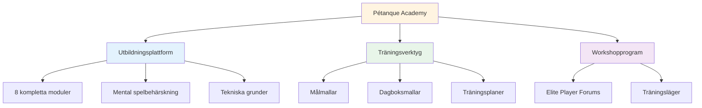
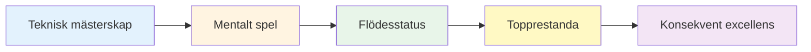

# Nyheter och uppdateringar

<AdBanner />

## Välkommen till Bouleakademin

::: tip Plattformen är nu live! 🎉
**Bouljonakademin är nu i full drift!**

Vi har lanserat en omfattande plattform dedikerad till att hjälpa elitboulespelare att nå sin fulla potential genom mental spelbehärskning, strukturerad träning och praktiska verktyg.
:::

<AdInArticle />

## Vad som är tillgängligt nu

### 📚 Komplett utbildningsplattform

Vi har lanserat **8 omfattande utbildningsmoduler** som täcker allt från flödestillstånd till näring:

| Modul | Vad som finns inuti | Viktiga funktioner |
|--------|---------------|--------------|
| **[Zonen](/sv/utbildning/zonen/)** | Flödeslägeskontroll | 4 detaljerade guider för att komma in i och bibehålla flödet |
| **[Mental styrka](/sv/utbildning/mental-styrka/)** | Tryckhantering | Rutiner före tagning, hantering av inre kritiker |
| **[Mindfulness](/sv/utbildning/mindfulness/)** | Medvetenhet i nuet | Dagliga träningar, tävlingstekniker |
| **[Goals](/sv/education/goals/)** | Strategisk planering | SMART-mål, hierarki, uppföljningssystem |
| **[Taktik](/sv/utbildning/taktik/)** | Spelstrategi | Beslutsfattande, sannolikhet, positionering |
| **[Lagspelare](/sv/utbildning/lagspelare/)** | Samarbetsförmåga | Kommunikation, förtroende, teamdynamik |
| **[Utbildning](/sv/utbildning/utbildning/)** | Övningsmetoder | Övningar, avsiktlig övning, progression |
| **[Näring](/sv/utbildning/näring/)** | Prestandabränsle | Blodsockerhantering, tävlingsnäring |

### 🛠️ Praktiska verktyg

**Färdiga mallar och program:**

- **[Workshop](/sv/workshop)** - Strukturerade 3-timmarspass för mental spelutveckling
- **[Träningsläger](/sv/träningsläger)** - Intensiva helgprogram för elitspelare
- **[Utbildningssession](/sv/utbildningssession)** - 2–3 timmars övningsramverk
- **[Målmall](/sv/målmall)** - Komplett system för målsättning och uppföljning
- **[Dagboksmall](/sv/dagboksmall)** - Daglig övnings- och reflektionsdagbok

### 🎯 Teknisk vägledning

**[Teknisk rådgivning](/sv/teknisk/)** avsnittet innehåller:
- Komplett guide till alla boulekast
- Strategier för val av banor
- Tekniker för spinnkontroll
- Ramverk för urval av bilder

### 🍽️ Näring för prestation

**[Mat](/sv/mat)** - Omfattande guide till:
- Blodsockerhantering för stabilt fokus
- Näringsstrategier före tävling
- Energioptimering för turneringar

### 📝 Artiklar och insikter

**NYTT: 14 djupgående artiklar** som täcker ämnen inom mentala spel:

| Kategori | Artiklar |
|----------|----------|
| **Att förstå den inre kritikern** | [Inre kritiker](/sv/blogg/inre-kritiker) - Bemästra din inre dialog |
| **Bygg rutiner före inspelning** | [Rutiner före fotografering](/sv/blogg/rutiner-för-tagning) - Skapa konsekvens |
| **Tryckhantering** | [Presshantering](/sv/blogg/presshantering) - Prestera under stress |
| **Prestationspsykologi** | [Flödestillstånd](/sv/blogg/flödestillståndsvetenskap) • [Mindfulness](/sv/blogg/mindfulness-tävling) • [Målsättning](/sv/blogg/elitmålsättning) • [Mental motståndskraft](/sv/blogg/mental-motståndskraft) |
| **Teamdynamik** | [Kommunikation](/sv/blogg/teamkommunikation) • [Teamkemi](/sv/blogg/teamkemi) • [Ledarskap](/sv/blogg/teamledarskap) |
| **Utbildning och utveckling** | [Misstag i mental träning](/sv/blogg/misstag i mental träning) • [Träningsstruktur](/sv/blogg/träningsstruktur) • [Tävlingsförberedelse](/sv/blogg/tävlingsförberedelse) |

➡️ **[Bläddra bland alla artiklar](/sv/blogg/)**

### 📖 Resurser

**Fallstudier och vittnesmål:**

- **[Fallstudier](/sv/fallstudier)** - Verkliga exempel på elitspelare som använder mental spelträning
- **[Referenser](/sv/referenser)** - Feedback från spelare som har implementerat dessa metoder

## Vårt uppdrag

::: tip Nästa nivå
Elitspelare har redan bemästrat tekniken. Nästa genombrott kommer från det **mentala spelet** – att lära sig att komma åt flödestillstånd, hantera press och prestera konsekvent på topp.

**Pétanque Academy tillhandahåller den kompletta färdplanen.**
:::

## Plattformstatistik

::: info Vad vi har byggt
- ✅ **8 utbildningsmoduler** med över 30 detaljerade guider
- ✅ **5 praktiska verktyg** redo att användas
- ✅ **10 språk** - tillgängligt över hela världen
- ✅ **100+ sidor** av innehåll på elitnivå
- ✅ **Sjöjungfrudiagram** för visuell inlärning
- ✅ **Kopiera-klistra-mallar** för omedelbar användning
:::

## Hur man kommer igång

### För nya besökare

**Börja med grunderna:**

1. **[Ambition](/sv/ambition)** - Förstå filosofin bakom elitutveckling
2. **[Zonen](/sv/utbildning/zonen/)** - Lär dig mer om flödestillstånd
3. **[Målmall](/sv/målmall)** - Sätt dina första strukturerade mål

### För erfarna spelare

**Dyk ner i avancerade ämnen:**

1. **[Mental styrka](/sv/utbildning/mental-styrka/)** - Bemästra pressade situationer
2. **[Taktik](/sv/utbildning/taktik/)** - Förfina strategiskt beslutsfattande
3. **[Workshop](/sv/workshop)** - Genomför strukturerade mentala spelsessioner

### För lag

**Bygg kollektiv excellens:**

1. **[Lagspelare](/sv/utbildning/lagspelare/)** - Förbättra lagdynamiken
2. **[Träningsläger](/sv/träningsläger)** - Organisera helgintensivkurser
3. **[Träningssession](/sv/träningssession)** - Strukturera teamövningar

## Vad som gör detta annorlunda

::: warning Varför Pétanque Academy sticker ut
**Mestadels träning fokuserar på teknik. Vi fokuserar på vad elitspelare faktiskt behöver:**

1. **Mental spelbehärskning** - Den verkliga skillnaden på höga nivåer
2. **Praktiska verktyg** - Inte bara teori, utan färdiga mallar
3. **Strukturerade program** - Tydliga ramar för workshops och läger
4. **Evidensbaserad** - Byggd på idrottspsykologi och forskning om flödestillstånd
5. **Elitfokuserad** - Utformad för spelare som redan bemästrar grunderna
:::

## Engagera dig

**Vill du bidra eller ge feedback?**

Besök vår sida **[Om oss](/sv/om oss)** för att:
- Läs mer om plattformen
- Dela din feedback
- Begär specifikt innehåll
- Kontakta oss

---

::: tip Börja din resa idag
Allt du behöver för att ta ditt spel till nästa nivå finns redan här. Välj en modul, hämta en mall och börja implementera.

**Välkommen till Pétanque Academy – där elitspelare blir exceptionella.**
:::

<AdBanner />
