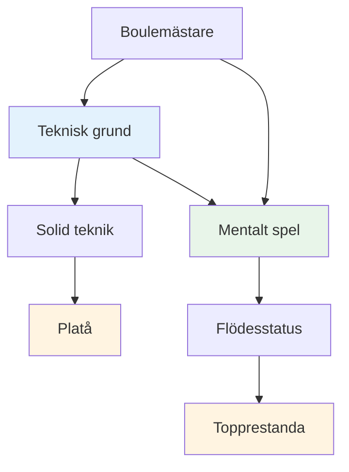
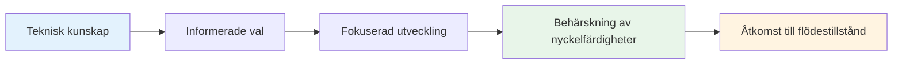

# Teknisk rådgivning

## En anmärkning om teknik

Medan vårt primära fokus ligger på det mentala spelet och flödet, inser vi att tekniken är grunden som allt annat bygger på.

::: info Vår filosofi
**Tekniken är grunden, men flytet är taket.** Du behöver en gedigen teknik för att nå elitnivå, men mental mästerskap är det som tar dig vidare.
:::

## Det vanligaste misstaget i teknisk träning

::: info Denna sektion är för erfarna spelare
Om du är nybörjare på boule behöver du naturligtvis utveckla din grundteknik från grunden – och det är en annan resa.

**Detta råd är för spelare som har spelat i flera år** och redan har en etablerad teknik som känns naturlig, avslappnad och pålitlig. Du har hittat ditt sätt att kasta. Nu är frågan: hur utvecklas du härifrån?
:::

::: warning Den vanliga fällan
När erfarna spelare vill förbättra sig går de ofta tillbaka till grunderna – justera greppet, armsvingen, släpppunkten, kroppspositionen. Timmar av övning. Oändliga finjusteringar.

**Men de har hoppat över den viktigaste frågan:** Vad exakt vill du att klotet ska göra?
:::

Innan du rör vid din teknik behöver du vara tydlig med vilket **resultat** du försöker uppnå. Inte &quot;Jag vill slå mer&quot; eller &quot;Jag vill vara mer konsekvent&quot; – det är inte resultat, det är önskningar.

Ett verkligt resultat ser ut så här:
- &quot;Jag vill ha en högbågig lob som stannar inom 20 cm från där den landar&quot;
- &quot;Jag vill ha ett rullande skott som svänger åt vänster i den här typen av terräng&quot;
- &quot;Jag vill ha ett mjukt, devanterat skott som knappt nuddar målklotet&quot;

**Först, utforska [Paletten av kast](/sv/tekniska/kast)** för att förstå vad som är möjligt. Bestäm sedan vilket specifikt kast du vill lägga till i din repertoar. Först då bör du börja arbeta med hur din arm, handled och kropp behöver röra sig för att skapa det resultatet.

## Rätt sätt att arbeta med teknik

Vi säger inte att du aldrig ska arbeta med din arm, handled, frigörelse eller kroppsposition. **Tekniskt arbete med utförande är absolut giltigt** — men det måste ha rätt syfte.

::: info Rätt syfte för tekniskt arbete
**Rätt syfte:** "Jag vill lägga till ett nytt kast i min repertoar"

**Fel syfte:** "Jag vill träffa fler skott" eller "Jag vill vara mer konsekvent"
:::

Här är processen:

1. **Utforska [Kastpaletten](/sv/tekniska/kast)** — Identifiera vilket kast eller vilken teknik du vill lägga till i din repertoar
2. **Visualisera resultatet** — Vad ska klotet göra? Vilken bana, landning, snurr och beteende behöver du?
3. **Arbeta sedan med utförandet** — Nu kan du fokusera på arm, handled, kroppsposition och släpp för att uppnå det specifika resultatet

Denna metod ger din tekniska träning **tydlig riktning och mätbara framsteg**. Du &quot;övar&quot; inte bara – du utökar medvetet dina förmågor.

::: tip Exempel: Lägga till en Plombée
**Mål:** Lägg till ett drop shot (plombée) i din pointing repertoar

**Resultatvisualisering:** Klotet ska böja sig högt, landa mjukt med bakåtsnurr och stanna nästan omedelbart

**Tekniskt fokus:** Högre utlösningspunkt, mer handledsaktion för bakåtspinning, mjukare grepp

**Framgångsmått:** Kan du utföra detta kast när du vill? Det är målet.
:::

## Bättre skott kontra fler skott: Förstå skillnaden

Det finns en avgörande skillnad som många spelare missar:

::: tip Den viktigaste insikten
**Om du vill göra BÄTTRE skott** → Jobba på din teknik

**Om du vill ta FLER shots** → Jobba på din mentala styrka
:::

### Vad betyder det?

**Att ta bättre bilder** innebär att utöka din tekniska repertoar:
- Lägga till nya typer av kast (plombée, portée, demi-portée)
- Förbättra precisionen på specifika slagtyper
- Att utveckla nya färdigheter du inte har för närvarande
- **Detta kräver teknisk övning och fysisk träning**

**Att ta fler bilder** innebär att utföra det du redan vet hur man gör:
- Att slå de slag du redan kan göra på träningen
- Presterar konsekvent under press
- Lita på din teknik när det gäller
- **Detta kräver mental träning och tillgång till flödestillstånd**

### Verklighetskontrollen

Fråga dig själv ärligt:
- Kan du göra skottet på träningen när du är avslappnad? ✅ **Då har du tekniken**
- Har du svårt att klara det på tävlingar? ⚠️ **Då behöver du mentalt arbete, inte mer teknisk övning**

::: warning Vanligt misstag
Många erfarna spelare lägger ner år på att finslipa sina tekniker, när det de egentligen behöver är att utveckla den mentala styrkan för att utföra dem under press.

**Du behöver inte en bättre armsving. Du behöver ett lugnare sinne.**
:::

### Vägen framåt

**För bättre bilder (nya funktioner):**
- Utforska [Paletten av kast](/sv/tekniska/kast)
- Välj ett specifikt nytt kast att utveckla
- Öva på det tekniska utförandet

**För fler doser (konsistens under tryck):**
- Arbeta med [Mental styrka](/sv/utbildning/mental-styrka/)
- Lär dig att komma åt [Zonen](/sv/utbildning/zonen/)
- Utveckla [Rutiner före skott](/sv/utbildning/mental-styrka/rutin-före-skott)

## Vårt perspektiv

::: tip Du behöver inte bemästra allt
**Du behöver inte behärska alla tekniker**, men att förstå hela paletten av möjligheter hjälper dig att:

- ✅ Vet vad som är möjligt
- ✅ Gör välgrundade val om vad du ska utveckla
- ✅ Uppskatta spelet på en djupare nivå
- ✅ Förstå vad elitspelare kan göra
:::

::: info Målet
Om du har ett tekniskt fokus och vill utöka din repertoar, beskriver det här avsnittet slutmålet – den kompletta paletten av kast som är tillgänglig för en boulespelare.

**Kom ihåg:** Målet är inte att bemästra allt. Det handlar om att ha tillräckligt med teknisk grund för att du ska kunna komma in i zonen och låta din kropp välja rätt kast naturligt.
:::

## Ämnen

### [Kastpalett](/sv/tekniska/kast)
Vilka kast finns det? En omfattande översikt över de tekniska möjligheterna inom boule.

::: tip Efter tekniken, vad händer nu?
När du väl har en gedigen teknik kommer den verkliga utvecklingen från:
- **[Zonen](/sv/utbildning/zonen/)** - Åtkomst till flödestillstånd
- **[Mental styrka](/sv/utbildning/mental-styrka/)** - Hantering av press
- **[Träningsmetoder](/sv/utbildning/träning/)** - Hur man övar effektivt
:::

