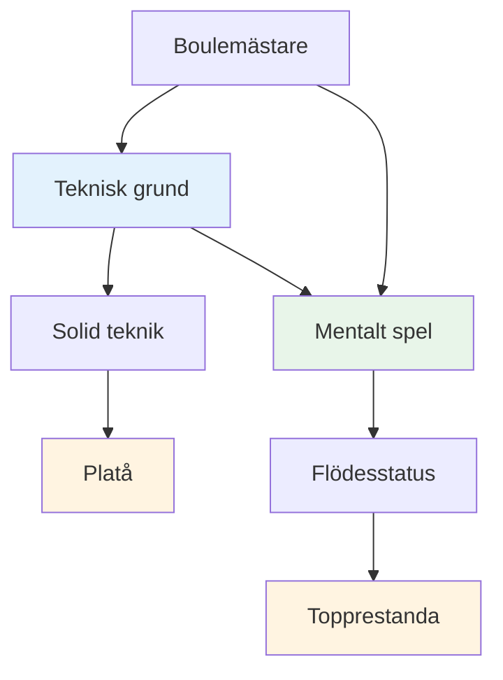
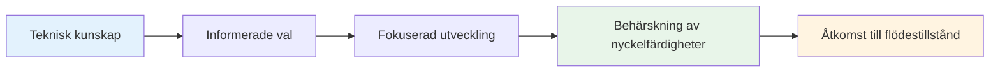

# Teknisk rådgivning

## En anmärkning om teknik

Medan vårt primära fokus ligger på det mentala spelet och flödet, inser vi att tekniken är grunden som allt annat bygger på.

::: info Vår filosofi
**Tekniken är grunden, men flytet är taket.** Du behöver en gedigen teknik för att nå elitnivå, men mental mästerskap är det som tar dig vidare.
:::

## Vårt perspektiv

::: tip Du behöver inte bemästra allt
**Du behöver inte behärska alla tekniker**, men att förstå hela paletten av möjligheter hjälper dig att:

- ✅ Vet vad som är möjligt
- ✅ Gör välgrundade val om vad du ska utveckla
- ✅ Uppskatta spelet på en djupare nivå
- ✅ Förstå vad elitspelare kan göra
:::

::: info Målet
Om du har ett tekniskt fokus och vill utöka din repertoar, beskriver det här avsnittet slutmålet – den kompletta paletten av kast som är tillgänglig för en boulespelare.

**Kom ihåg:** Målet är inte att bemästra allt. Det handlar om att ha tillräckligt med teknisk grund för att du ska kunna komma in i zonen och låta din kropp välja rätt kast naturligt.
:::

## Ämnen

### [Kastpalett](/sv/tekniska/kast)
Vilka kast finns det? En omfattande översikt över de tekniska möjligheterna inom boule.

::: tip Efter tekniken, vad händer nu?
När du väl har en gedigen teknik kommer den verkliga utvecklingen från:
- **[Zonen](/sv/utbildning/zonen/)** - Åtkomst till flödestillstånd
- **[Mental styrka](/sv/utbildning/mental-styrka/)** - Hantering av press
- **[Träningsmetoder](/sv/utbildning/träning/)** - Hur man övar effektivt
:::

