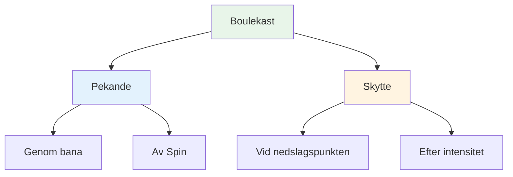
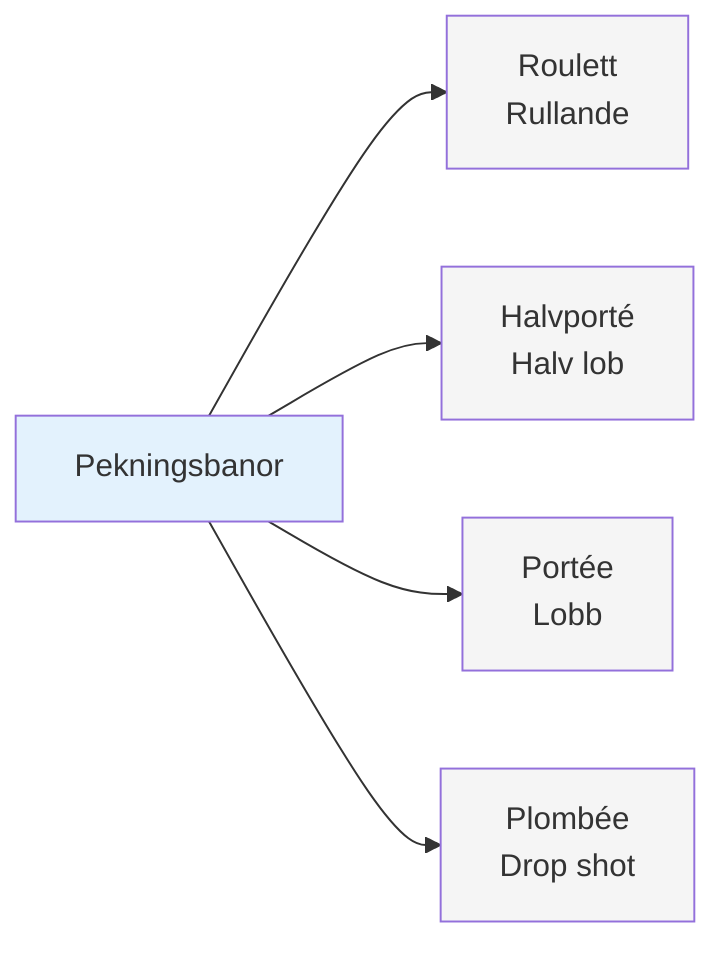
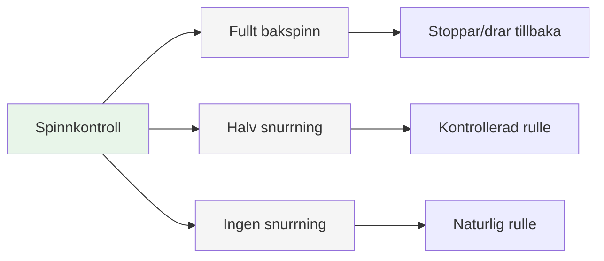
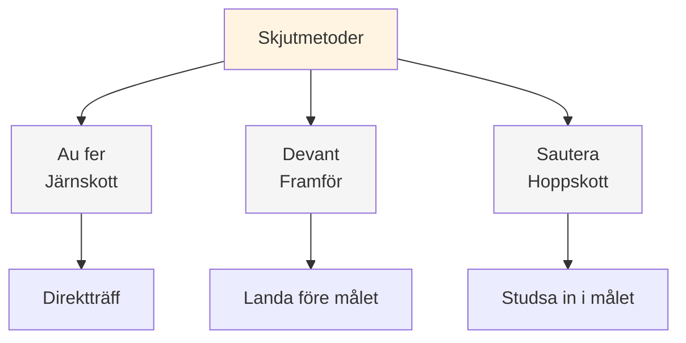
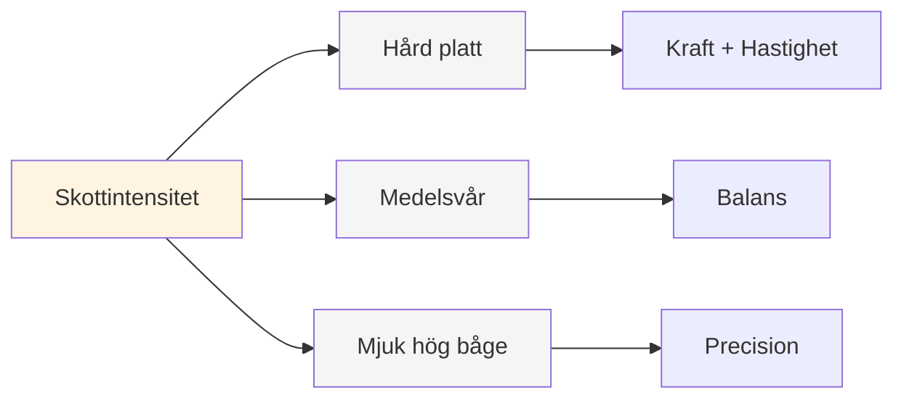
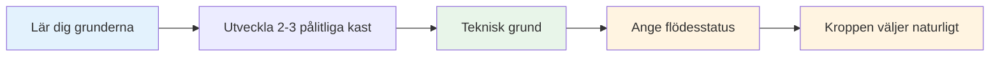

# Palett av plädar

## Den kompletta tekniska repertoaren

Detta är en översikt över de olika kast som finns tillgängliga i boule. Du behöver inte behärska alla, men att veta vad som finns hjälper dig att förstå spelets fulla omfattning.

::: tip Den stora bilden
**Att förstå hela paletten hjälper dig att fatta välgrundade beslut om vad du ska utveckla.** Du behöver inte behärska allt – fokusera på vad som fungerar för ditt spel.
:::

## Pektekniker

### Genom bana

| Kasta | Fransk term | Bana | När man ska använda |
|-------|-------------|------------|-------------|
| **Rullande** | Roulett | Låg, rullar större delen av vägen | Slät terräng, kort avstånd |
| **Halv lob** | Halvporté | Medel, landar halvvägs | Vanligast, mångsidigast |
| **Lobb** | Portée | Hög, landar nära målet | Hinder, ojämn terräng |
| **Drop shot** | Plombée | Mycket högt, faller vertikalt | Trånga utrymmen, precisionsplacering |

### Av Spin

| Spinntyp | Effekt på landning | När man ska använda |
|-----------|-------------------|-------------|
| **Full spinn (bakspinn)** | Stannar eller drar sig tillbaka vid landning | Behöver stanna snabbt, undvik att rulla förbi |
| **Halv snurrning** | Måttlig bakspinn, kontrollerad rullning | Mest mångsidig, förutsägbar |
| **Ingen snurrning** | Neutral, naturlig roll vid landning | Låt terrängen diktera rullning |

## Skjuttekniker

### Vid nedslagspunkten

| Teknik | Fransk term | Islagspunkt | Egenskaper |
|-----------|-------------|--------------|-----------------|
| **Järnskott** | Au fer | Direktträff på klotet | Vanligaste, rena kontakten |
| **Framför** | Devant | Landar strax före målet | Säkrare, mindre precision krävs |
| **Hoppskott** | Sautera | Studsar in i målet | Avancerad, för hinder |

### Efter intensitet

| Intensitet | Bana | När man ska använda |
|-----------|------------|-------------|
| **Hårt plattskott** | Direkt, kraftfull, platt | Tydlig linje, behöver avstånd vid träff |
| **Medelhård** | Balanserad kraft och kontroll | Mest mångsidig |
| **Mjuk med hög hålfot** | Lobbskott, faller uppifrån | Hinder, trånga utrymmen |

## Den kompletta paletten

::: details Snabbreferens: Alla kast
**Pekande:**
- Roulette (rullande)
- Demiportée (halv lob)
- Portée (lob)
- Plombée (drop shot)
- Full centrifugering / Halv centrifugering / Ingen centrifugering

**Skytte:**
- Au fer (järnskott)
- Devant (framför)
- Sautée (hoppskott)
- Hård platt / Medium / Mjuk hög båge
:::

## Mästarvägen

::: tip Komma ihåg
**Målet är inte att bemästra allt.** Det handlar om att ha tillräckligt med teknisk grund för att du ska kunna komma in i zonen och låta din kropp välja rätt kast naturligt.

Fokusera på:
1. **2–3 pektekniker** du kan lita på
2. **1–2 fotograferingsmetoder** som fungerar för dig
3. **Konsekvent utförande** under press
4. **Mentalt spel** för att komma åt flödestillstånd
:::

::: info Nästa steg
När du väl har en gedigen teknik kommer den verkliga utvecklingen från:
- **[Zonen](/sv/utbildning/zonen/)** - Åtkomst till flödestillstånd konsekvent
- **[Träningsmetoder](/sv/utbildning/träning/)** - Hur man övar effektivt
- **[Mental styrka](/sv/utbildning/mental-styrka/)** - Prestera under press
:::

