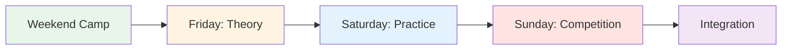
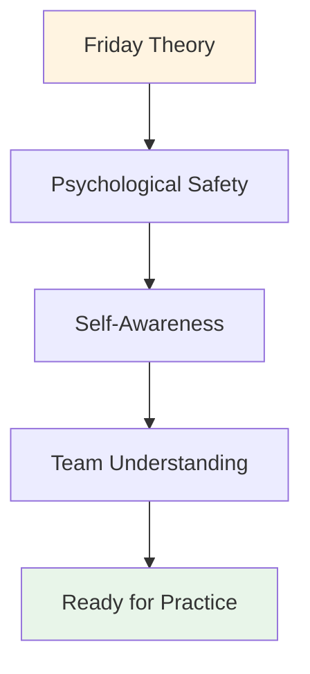

# Träningsläger: Helgguide

<AdBanner />

## Hur man genomför ett helgträningsläger för 10–20 spelare

Den här omfattande guiden hjälper dig att organisera och genomföra ett träningsläger på helgen som kombinerar teori, praktik och tävling. Blanda det mentala spelinnehållet från den här webbplatsen med träning i pisten för maximal effekt.

::: tip Träningslägrets filosofi
**Teori utan praktik är bara information. Övning utan teori är bara repetition. Tävling utan reflektion är bara lek.** Den här helgen integrerar alla tre för transformerande lärande.
:::

## Planering före lägret

### Gruppstorlek och struktur

**Optimalt:** 10–20 spelare
- **Lite läger (10-12):** Mer intimt, djupare delning
- **Stort läger (16-20):** Mer mångsidiga perspektiv, kräver undergrupper

**Lagstruktur:**
- Dela upp er i lag om 3-4 personer för träning och tävling
- Blanda skicklighetsnivåer och spelstilar
- Rotera lagen under helgen

### Personalkrav

| Roll | Ansvar | Kvantitet |
|------|-------------------|----------|
| **Koordinator för mental prestation** | Leder teoripass, gruppdynamik | 1 |
| **Teknisk tränare** | Övervaka träning, ge feedback | 1-2 |
| **Tävlingsledare** | Led turnering, hantera logistik | 1 |
| **Stödpersonal** | Måltider, upplägg, administration | 1-2 |

### Platskrav

::: info Anläggningsbehov
**Pist:**
- Flera terränger (minst 3-4 pister)
- Olika underlag om möjligt (grus, sand, hårda)
- Belysning för kvällslek

**Inomhusutrymme:**
- Plats för 20 personer i cirkel (teoripass)
- Separat från pisten
- Whiteboard/projektor
- Bekväma sittplatser

**Logi:**
- På plats eller i närheten (gångavstånd)
- Delade rum uppmuntrar till sammanhållning
- Tyst plats för reflektion

**Catering:**
- Näringsfokuserade måltider (se [Matguide](./food))
- Undvik sockerkrascher
- Vätskestationer
:::

### Materialchecklista

::: details Komplett materiallista
**Teoripass:**
- [ ] Stolar för cirklar (inga bord)
- [ ] Boule och cochonnet för centrum
- [ ] Flipcharts och markörer
- [ ] Fästlappar
- [ ] Arbetsblad (Användarmanual, Inre kritiker, etc.)
- [ ] Papper och pennor
- [ ] Projektor (för webbplatsinnehåll)

**Övningspass:**
- [ ] Måttband
- [ ] Koner/markörer för borrar
- [ ] Videokamera/stativ
- [ ] Urklipp och papper (spårning)
- [ ] Vissla

**Konkurrens:**
- [ ] Poänglistor
- [ ] Turneringsställning
- [ ] Priser/erkännande
- [ ] Första hjälpen-kit

**Logistik:**
- [ ] Namnskyltar
- [ ] Deltagarlista med kontakter
- [ ] Kontaktinformation vid nödsituation
- [ ] Vattenflaskor
- [ ] Solskyddsmedel
- [ ] Vävnadspapper (för känslomässigt arbete!)
:::

## Helgschema

### Fredag kväll (3 timmar)

**18:00-18:30 - Ankomst och välkomst**
- Incheckning
- Rumstilldelningar
- Översikt över helgen

**18:30-19:30 - Middag**
- Näringsfokuserad måltid
- Informella introduktioner

**19:30-22:30 - Teoripass: Grunderna**

Använd [Workshopguiden](./workshop) för detaljerad handledning:

1. **Grundregler (15 min)** - Skapa psykologisk trygghet
2. **Incheckningsmatris (20 min)** - Bedöm gruppens energi
3. **Isberget (30 min)** - Utforska inre tankar
4. **Användarmanual (45 min)** - Bygg upp teamförståelse
5. **Rädsla i en hatt (45 min)** - Bryt isoleringen
6. **Utcheckning (15 min)** - Slut på slingan

**22:30 - Fritid**
- Informellt umgänge
- Vila och reflektion

<AdInArticle />

### Lördag (Heldag - Teori + Praktik)

**08:00-09:00 - Frukost och mindfulness**
- Lugn frukost
- Valfri 15-minuters guidad meditation
- Sätt upp avsikter för dagen

**09:00-10:30 - Teoripass: Att koppla innehåll till upplevelse**

Välj 3-4 ämnen från Akademins webbplats och utforska det inre spelet:

**Exempelämnen:**

1. **[Näring](./utbildning/näring/)** (20 min)
   - &quot;Hur förändras ditt matval under press?&quot;
   – &quot;Äter du vad din kropp behöver eller vad din ångest vill ha?&quot;
   - Övning: Planera kost inför tävlingsdagen

2. **[Mental styrka](./utbildning/mental-styrka/)** (25 min)
   - &quot;Hur ser din relation ut till misslyckande?&quot;
   – &quot;Hur pratar man med sig själv efter en miss?&quot;
   - Aktivitet: Omformulera inre kritiker till inre coach

3. **[Mindfulness](./utbildning/mindfulness/)** (25 min)
   - &quot;Vart går dina tankar under pausen innan du kastar?&quot;
   – &quot;Vad drar dig ur nuet?&quot;
   - Övning: 5-minuters kroppsskanning

4. **[Taktik](./utbildning/taktik/)** (20 min)
   – &quot;Beras ditt val av skott på strategi eller rädsla?&quot;
   - &quot;När spelar man säkert kontra att ta risker?&quot;
   - Diskutera: Riskprofiler i gruppen

**10:30-10:45 - Paus**

**10:45-12:30 - Integration i pisten: Övningar med mentalt fokus**

**Övning 1: Välj din chans (30 min)**

Från [Workshopguiden](./workshop) - öva på att äga avsikt och tvivla:

1. Tillkännage målet: &quot;Jag skjuter med järnet&quot;
2. Ange självförtroende: &quot;Jag får 7 av 10&quot;
3. Namnge den inre tanken: &quot;Min inre röst oroar sig för bakåtspinn&quot;
4. Utför skottet
5. Reflektera: &quot;Vad hände? Vad lärde du dig?&quot;

**Övning 2: Kognitiv interferens (30 min)**

Testa om tekniken har blivit automatisk:
- Koordinatorn ställer komplexa frågor medan spelaren skjuter
- &quot;Nämn 5 huvudstäder&quot; eller &quot;Räkna baklänges från 100 gånger 7&quot;
- Framgång = teknik är implicit, inte medvetet bearbetad

**Övning 3: Övning i användarmanual (30 min)**

Använd användarmanualerna från och med fredag:
- Spela i lag om 3
- Efter varje skott svarar lagkamraterna enligt användarmanualen
- &quot;Marc behöver tystnad efter en miss&quot; - laget hedrar det
- Sammanfattning: &quot;Hur kändes det att bli förstådd?&quot;

**12:30-14:00 - Lunch och vila**
- Näringsfokuserad måltid
- Tyst tid för reflektion
- Valfritt: Individuella incheckningar med koordinator

**14:00-17:00 - Träningspass: Terränganpassning**

**Mål:** Bygga anpassningsförmåga och mental flexibilitet

**Inställning:**
- Rotera genom 3-4 olika terränger/pister
- 45 minuter per terräng
- Fokusera på mental anpassning, inte bara teknisk

**Rotationsstruktur:**

| Terräng | Mentalt fokus | Träning |
|---------|--------------|----------|
| **Terräng 1: Mjuk/Sand** | Acceptans av osäkerhet | &quot;Den obefintliga - acceptera det som är&quot; |
| **Terräng 2: Hård/Grusig** | Precision under press | &quot;Lita på din teknik&quot; |
| **Terräng 3: Ojämn** | Känsloreglering | &quot;Var lugn när det är orättvist&quot; |
| **Terräng 4: Tävling** | Åtkomst till flödesläge | &quot;Hitta zonen&quot; |

**Underlättande:**
- Teknisk coach ger feedback på teknik
- MPC frågar: &quot;Vad händer i ditt sinne just nu?&quot;
- Spelarjournal mellan rotationer

**17:00-18:00 - Paus och reflektion**
- Individuell journalföring
– &quot;Vad lärde du dig om dig själv idag?&quot;
- &quot;Vad är en sak du kommer att göra annorlunda imorgon?&quot;

**18:00-19:00 - Middag**

**19:00-21:00 - Kvällsteori: Djup sårbarhet**

**Aktivitet 1: Att omformulera den inre kritikern (45 min)**

Se [Workshopguide](./workshop) för fullständigt protokoll:
1. Identifiera den exakta kritikerfrasen
2. Omformulera som inre coach
3. Partnerpraktik

**Aktivitet 2: Tävlingsförberedelser (45 min)**

Imorgon är det tävlingsdag. Förbered dig mentalt:

1. **Visualisering (15 min)**
   - Slut ögonen
   - Föreställ dig det perfekta skottet
   - Känn självförtroendet
   - Lägg märke till lugnet

2. **Teamprotokoll (20 min)**
   - Skapa signaler för stöd
   - &quot;Jag behöver en återställning&quot; = röra klot
   - &quot;Jag behöver uppmuntran&quot; = knytnäve
   - &quot;Jag behöver utrymme&quot; = ta ett steg tillbaka

3. **Sätt upp avsikter (10 min)**
   – &quot;Imorgon ska jag fokusera på...&quot;
   – &quot;Mitt mål är inte att vinna, utan att...&quot;
   – &quot;Jag ska öva...&quot;

**Utcheckning (30 min)**
- Dela en rädsla om morgondagen
- Dela en avsikt
- Gruppstöd

**21:00 - Fritid**
- Tidigt i säng (tävling imorgon!)
- Tyst reflektion

### Söndag (Tävlingsdag)

**08:00-09:00 - Frukost och mental förberedelse**
- Lätt frukost (se [Kostnadsguide](./utbildning/näring/))
- 15 minuters mindfulnessövning
- Teammöten

**09:00-09:30 - Tävlingsbriefing**

**Format:** Round-robin-turnering
- Lag om 3
- Spela till 13 poäng
- Alla spelar alla
- Fokusera på PROCESS, inte resultat

**Twisten: Poängsättning av mental prestation**

::: spets Dubbelt poängsystem
**Traditionell:** Vunna poäng
**Mental prestation:** Poängsatt av MPC

Mentala prestationspoäng (0-5 per match):
- Använda användarhandledningsverktyg
- Effektivt stöd för lagkamrater
- Hanterad inre kritiker
- Förblev närvarande (inte uppehålla mig vid tidigare bilder)
- Bevisad psykologisk trygghet

**Vinnare:** Bästa kombinerade poäng (traditionell + mental)
:::

**09:30-13:00 - Morgontävling**
- Round-robin-matcher
- MPC observerar och poängsätter
- Teknisk tränare ger kort feedback mellan matcherna
- Vätskeintag och mellanmålspauser

**13:00-14:00 - Lunch**
- Näringsfokuserad
- Informell reflektion
- Vila

**14:00-17:00 - Eftermiddagstävling**
- Fortsätt round-robin
- Semifinaler och finaler
- Ökande tryck
- Tillämpa morgonens lärdomar

**17:00-17:30 - Utmärkelser och erkännanden**

**Kategorier:**
- Traditionell vinnare
- Vinnare av mental prestation
- Mest förbättrade
- Bästa lagkamraten
- Modpris (mest sårbara)

**17:30-19:00 - Slutreflektion**

**Kritisk:** Det är här lärandet cementeras.

**Strukturera:**

**1. Individuell reflektion (15 min)**
Skriv i dagboken:
- Vad lärde du dig om dig själv i helgen?
- Vad överraskade dig?
- Vad kommer du att göra annorlunda?
- Vad tar du med dig hem?

**2. Delning i liten grupp (30 min)**
Grupper om 4-5:
- Dela viktiga insikter
- Vad berörde mest?
- Vad var svårast?
- Vad var mest värdefullt?

**3. Fullständig gruppintegration (30 min)**
Ringa upp:
- Varje person delar EN viktig lärdom
- MPC validerar och kopplar samman teman
- Diskutera: &quot;Hur kommer ni att tillämpa detta?&quot;

**4. Åtaganden (15 min)**
- Varje person åtar sig ett åtagande
- &quot;I min nästa tävling ska jag...&quot;
- Gruppvittnen och stöd

**5. Avslutning (15 min)**
- Tacka deltagarna för modet
- Påminn om sekretessen
- Utbyta kontakter
- Planera uppföljning (valfritt online-möte)

**19:00 - Middag och avresa**

<AdInArticle />

## Tips för facilitering

### Balans mellan teori och praktik

::: warning Överbelasta inte teorin
**Misstaget:** För mycket prat, för lite handling

**Saldo:**
- Teori skapar medvetenhet
- Övning bygger färdigheter
- Integrering av tävlingstester
- Reflektion cementerar lärandet

**Tumregel:** 30 % teori, 40 % praktik, 20 % tävling, 10 % reflektion
:::

### Hantera gruppdynamik

**Tävlingsalfa:**
- Vill vinna till varje pris
- Motstår sårbarhet
- **Strategi:** Kanalisera tävlingsinriktningen till mental prestationsbedömning

**Den tysta observatören:**
- Tar in allt, delar inte
- **Strategi:** Skapa ingångspunkter med låg risk, validera observation som deltagande

**Skeptikern:**
- &quot;Det här känsliga materialet fungerar inte&quot;
- **Strategi:** Verbal Aikido - rikta in dig och vrid (se [Workshopguide](./workshop))

**Den som delar för mycket:**
- Dominerar diskussionen
- **Strategi:** &quot;Tack, vi hör av oss till andra&quot;

### Hantera känslomässiga stunder

**Någon gråter under Rädsla i hatten:**
- ✅ Normalisera: &quot;Tårar är mod, inte svaghet&quot;
- ✅ Erbjud näsdukar, ha inte bråttom
- ✅ Fråga: &quot;Vad behöver du just nu?&quot;
- ❌ Gör inte: &quot;Det är okej, gråt inte&quot;

**Konflikt mellan spelare:**
- ✅ Pausa och adressera
- ✅ &quot;Vad händer just nu?&quot;
- ✅ Använd som lärandeögonblick
- ❌ Gör inte: Ignorera eller minimera

**Någon stänger av:**
- ✅ Checka in privat under rasten
- ✅ &quot;Jag märkte att du blev tyst. Vad är det som händer?&quot;
- ✅ Erbjudandealternativ: delta annorlunda, ta en paus
- ❌ Gör inte: Ropa ut offentligt

## Uppföljning efter lägret

### Omedelbar (24–48 timmar)

**Skicka till alla deltagare:**
- Tackmeddelande
- Sammanfattning av viktiga slutsatser
- Bilder från helgen
- Kontaktlista (med tillstånd)
- Länk till resurser på webbplatsen

**Individuella incheckningar:**
- Sms:a alla som delat mycket
– &quot;Hur känner du dig inför helgen?&quot;
- Ta itu med eventuell sårbarhetsbaksmälla

### Kortsiktig (2 veckor)

**Valfri online-session (60-90 min):**
- Hur har du tillämpat lärdomarna?
- Vad fungerar? Vad är utmanande?
- Kamratstöd och problemlösning
- Förstärka åtaganden

### Långsiktig (1–3 månader)

**Deltagare i undersökningen:**
- Vad är annorlunda i ditt spel?
- Vilka verktyg använder du fortfarande?
- Vad skulle göra nästa läger bättre?
- Skulle du rekommendera till andra?

**Påverkan på banan:**
- Tävlingsresultat
- Självrapporterat självförtroende
- Teamdynamik
- Fortsatt engagemang

## Anpassning för olika gruppstorlekar

### Litet läger (10–12 spelare)

**Fördelar:**
- Djupare delning
- Mer individuell uppmärksamhet
- Starkare band

**Justeringar:**
- En grupp för all teori
- Mer tid per person i aktiviteter
- Intimt tävlingsformat

### Stort läger (16–20 spelare)

**Fördelar:**
- Olika perspektiv
- Mer variation i tävlingar
- Stordriftsfördelar

**Justeringar:**
- Dela upp oss i två grupper för några teoripass
- Behöver 2 MPC/handledare
- Större turneringsstreck
- Mer strukturerade rotationer

## Budgetöverväganden

### Intäkter

| Artikel | Pris per person | 20 personer | 10 personer |
|------|-------------------|------------|-----------|
| **Registrering** | 150–250 € | 3 000–5 000 € | 1 500–2 500 € |

### Utgifter

| Kategori | Kostnad | Anteckningar |
|----------|------|-------|
| **Facilitetsuthyrning** | 500–1 000 € | Helgpris |
| **Boende** | 40–60 €/person/natt | Delade rum |
| **Måltider** | 30–40 €/person/dag | 6 måltider |
| **Personal** | 500–1 000 € | MPC + tränare |
| **Material** | 100–200 € | Arbetsblad, förnödenheter |
| **Priser** | 100–200 € | Utmärkelseartiklar |

**Totalt per person:** 120–180 €
**Marginal:** 30–70 euro/person (eller nollpunkt för samhällsbyggande)

## Framgångsmått

### Omedelbara indikatorer

- [ ] Psykologisk säkerhetspoäng (1–10 i genomsnitt &gt;7)
- [ ] Deltagandegrad (&gt;80 % delar aktivt)
- [ ] Färdigställandegrad (&gt;90 % stannar hela helgen)
- [ ] Nöjdhetspoäng (1–10 i genomsnitt &gt;8)

### Långsiktiga indikatorer

- [ ] Beteendeförändring (med hjälp av verktyg i tävling)
- [ ] Prestationsförbättring (självrapporterad)
- [ ] Gemenskapsbyggande (hålla kontakten)
- [ ] Referenser (rekommendationer till andra)

## Vanliga misstag att undvika

::: danger Fallgropar
**1. För mycket innehåll**
- Försöker täcka över allt
- **Åtgärd:** Fokusera på djup, inte bredd

**2. Hoppa över reflektion**
- Skynda till nästa aktivitet
- **Åtgärd:** Bygg in bearbetningstid

**3. Ignorerar motstånd**
- Att övervinna skepticism
- **Åtgärd:** Ta itu med det direkt med verbal aikido

**4. Teknisk coachning under teorin**
- Blanda roller
- **Åtgärd:** Tydliga gränser mellan MPC och teknisk tränare

**5. Ingen uppföljning**
- Helgen är slut, lärandet slutar
- **Åtgärd:** Planera kontaktpunkter efter lägret
:::

## Resurser

### Från denna webbplats

- [Workshopguide](./workshop) - Detaljerade protokoll för handledning
- [Guide för träningssession](./training-session) - För kontinuerlig övning
- [Näring](./utbildning/näring/) - Protokoll för tävlingsdagen
- [Mental styrka](./utbildning/mental-styrka/) - Inre spelkoncept
- [Mindfulness](./utbildning/mindfulness/) - Närvarotekniker
- [Taktik](./utbildning/taktik/) - Strategiskt tänkande

### Rekommenderad läsning

- *Tennisens inre spel* av Timothy Gallwey
- *Tankesätt* av Carol Dweck
- *Den orädda organisationen* av Amy Edmondson

<AdBanner />

