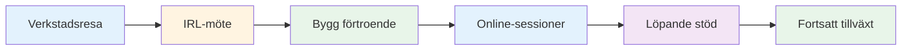
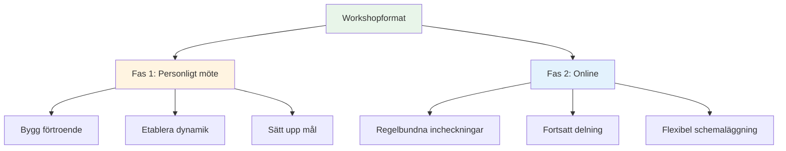
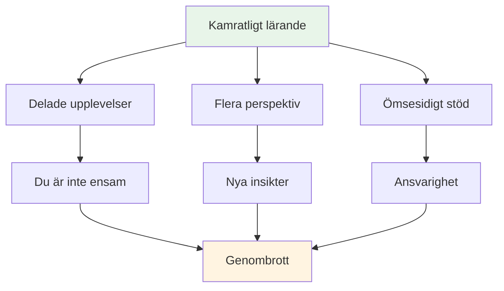

# Verkstad

## Forum för elitspelare

Våra workshops är intima forum där elitspelare delar erfarenheter och öppnar upp sina inre tankar om spelet, prestationer och mentala utmaningar.

::: tip Vad som gör våra workshops annorlunda
**Små, utvalda grupper av elitspelare i en trygg miljö för ärlig diskussion.** Detta är inte en föreläsning – det är en ömsesidig lärandeupplevelse där ni delar, lär er och växer tillsammans.
:::

## Formatera

### Små grupper
::: info Gruppstorlek
- **6–8 spelare** per workshop
- Noggrant utvalda grupper för optimal dynamik
- Trygg plats för ärlig diskussion
- Alla bidrar, alla lär sig
:::

### Hybridmetod

| Fas | Formatera | Ändamål | Fördelar |
|-------|--------|---------|----------|
| **Första mötet** | Personligen (IRL) | Bygg grunden | Förtroende, kontakt, gruppdynamik |
| **Pågående sessioner** | Online | Behåll momentum | Regelbundet stöd, flexibilitet, ansvarsskyldighet |

::: details Fas 1: Möte på plats
**Varför först personligen?**
- Bygg förtroende och kontakt ansikte mot ansikte
- Skapa gruppdynamik och trygghet
- Sätt upp mål och intentioner tillsammans
- Skapa grunden för ärlig delning

**Vad händer:**
- Introduktioner och målsättning
- Inledande övningar och diskussioner
- Att etablera gruppnormer
- Bygga upp en relation
:::

::: details Fas 2: Online-sessioner
**Varför online för kontinuerlig användning?**
- Regelbundna incheckningar utan resor
- Fortsatt delning och stöd
- Flexibel schemaläggning för upptagna spelare
- Bibehåll momentum mellan möten

**Vad händer:**
- Framstegsuppdateringar och utmaningar
- Kamratstöd och problemlösning
- Ansvarskontroll
- Fortsatt lärande och tillväxt
:::

## Vad man kan förvänta sig

### Ämnen vi utforskar

| Område | Fokus | Resultat |
|------|-------|----------|
| **Mentalt spel** | Flödestillstånd, tryck, fokus | Konsekvent topprestanda |
| **Personliga utmaningar** | Rädslor, blockeringar, frustrationer | Genombrott och lösningar |
| **Kamratlärande** | Delade upplevelser | Nya perspektiv och insikter |
| **Praktiska verktyg** | Tekniker och övningar | Omedelbar ansökan |
| **Gemenskap** | Kontinuerligt stöd | Långsiktig tillväxt |

::: tip Verkstadserfarenhet
- 🧠 Djupa diskussioner om spelets mentala aspekter
- 💬 Dela personliga erfarenheter och utmaningar
- 🤝 Kamratstöd och ansvarsskyldighet
- 🛠️ Praktiska övningar och tekniker
- 👥 En community av spelare som är engagerade i tillväxt
:::

## Vem borde gå med?

::: info Ideala deltagare
- **Elitspelare** som vill ta nästa steg
- Spelare som har **bemästrat tekniken** men vill ha mer
- De som är intresserade av det **mentala spelet**
- Spelare öppna för **ärlig självreflektion**
- Engagerad i **personlig utveckling**
:::

::: warning Inte en bra passform om
- Du söker endast teknisk coachning
- Du känner dig inte bekväm med att dela i en grupp
- Du är inte villig att vara sårbar
- Du vill ha snabba lösningar utan att behöva göra jobbet
:::

## Värdet av kamratligt lärande

::: tip Varför kamratgrupper fungerar
Elitspelare står inför unika utmaningar som andra inte förstår. På en workshop är du med människor som **förstår** – pressen, förväntningarna, de mentala striderna. Detta skapar en trygg plats för verklig utveckling.
:::

## Redo att gå med?

::: info Nästa steg
Workshops annonseras i vår [Nyheter](/sv/nyheter/)-sektion. Håll utkik efter kommande datum och information om anmälan.
:::

